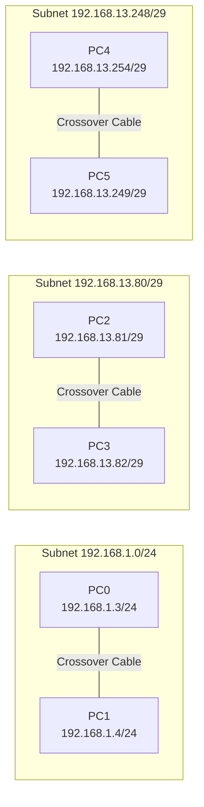
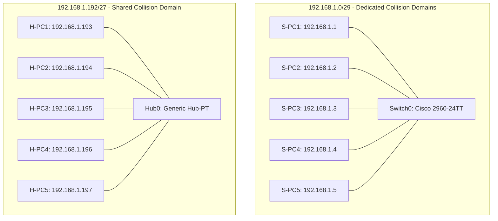
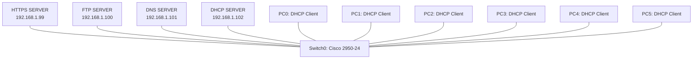
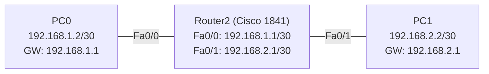
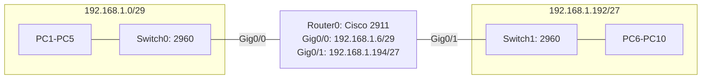
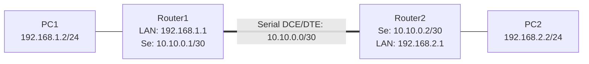
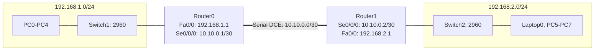
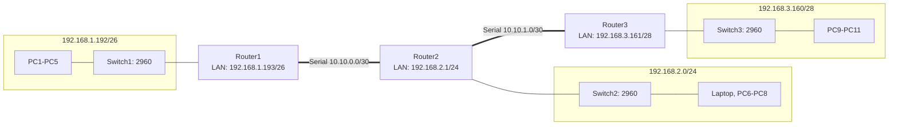
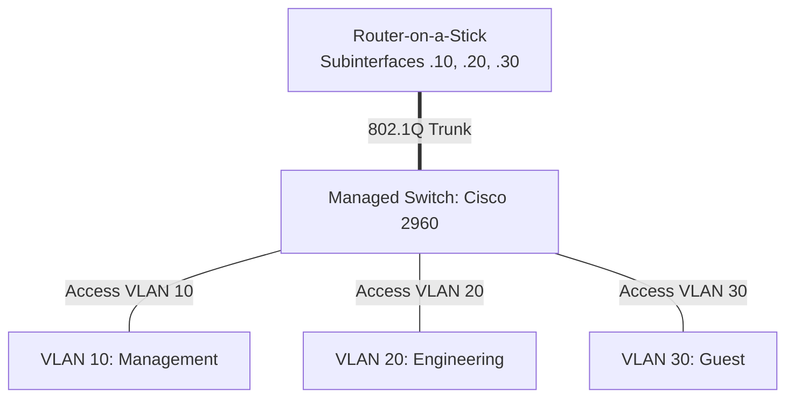

# 🌐 deep-in-net


Welcome to **deep-in-net**! 🚀 This repository contains verified solutions, network topologies, Cisco IOS CLI configurations, step-by-step guides, tool-free mental subnetting calculations, and peer-audit cheat sheets for the **deep-in-net** networking module using **Cisco Packet Tracer**.

---

## 📑 Table of Contents
1. [Repository Structure & Submission Deliverables](#repository-structure)
2. [Prerequisites & Installation](#prerequisites)
3. [Tool-Free Subnetting Masterclass (Mental Math)](#mental-subnetting)
4. [Step-by-Step Exercise Guides & Topologies](#exercise-guides)
   - [Exercise 1: Crossover Cable Host-to-Host Links](#exercise-1)
   - [Exercise 2: Switch vs Hub Collision Domain Topologies](#exercise-2)
   - [Exercise 3: Core Network Services (DHCP, DNS, HTTPS, FTP)](#exercise-3)
   - [Exercise 4: Single Router & Default Gateway Topology](#exercise-4)
   - [Exercise 5: Multi-Switch Subnet Routing](#exercise-5)
   - [Exercise 6: Multi-Router Static Routing Tables](#exercise-6)
   - [Exercise 7: Dual-Router Subnet Interconnection (Live Audit Task)](#exercise-7)
   - [Exercise 8: 3-Subnet Chain Static Routing Topology](#exercise-8)
   - [Bonus Exercise: Advanced VLAN Segmentation & Inter-VLAN Routing](#bonus-exercise)
5. [Comprehensive Beginner-Friendly Audit Guide (Q&A)](#audit-guide)
   - [Section 1: Physical Layer & Cabling (Exercise 1)](#audit-section-1)
   - [Section 2: Switches vs Hubs (Exercise 2)](#audit-section-2)
   - [Section 3: Core Network Services (Exercise 3)](#audit-section-3)
   - [Section 4: Routers & Routing (Exercises 4–8)](#audit-section-4)
   - [Section 5: Live Recreation & Bonus Defense](#audit-section-5)
6. [Automated Verification Suite (`verify_topology.sh`)](#verification-suite)
7. [License](#license)

---

<a id="repository-structure"></a>
## 📂 Repository Structure & Submission Deliverables

Per official audit guidelines, all simulation `.pkt` files and documentation must be present directly in the repository root:

```console
deep-in-net/
├── ex01.pkt              # Exercise 1: Crossover Cable Host-to-Host Links
├── ex02.pkt              # Exercise 2: Switch vs Hub Collision Domains
├── ex03.pkt              # Exercise 3: Core Network Services (DHCP, DNS, HTTPS, FTP)
├── ex04.pkt              # Exercise 4: Single Router & Default Gateway Topology
├── ex05.pkt              # Exercise 5: Multi-Switch Subnet Routing
├── ex06.pkt              # Exercise 6: Multi-Router Static Routing Tables
├── ex07.pkt              # Exercise 7: Dual-Router Subnet Interconnection (Live Audit)
├── ex08.pkt              # Exercise 8: 3-Subnet Chain Static Routing Topology
├── README.md             # Detailed Documentation, Topologies, CLI commands, Audit Q&A
├── audit.md              # Official Evaluator Audit Checklist
├── AUDIT_GUIDE.md        # Comprehensive Examination Defense Guide & Live Speed-Run Protocol
├── verify_topology.sh    # Automated Verification & Subnetting Validation Script
├── AGENTS.md             # Agent Guidelines & Repository Architecture
└── docs/
    ├── implementation_plan.md # Architectural Implementation Plan
    └── requirements/
        ├── readme.md     # Subject Specifications
        └── audit.md      # Evaluator Audit Rubric
```

> **Note**: `bonus.pkt` is optional per the official audit rubric (`docs/requirements/audit.md`).

---

<a id="prerequisites"></a>
## 🛠️ Prerequisites & Installation

To open, inspect, modify, and simulate the `.pkt` network topologies:

1. **Download Cisco Packet Tracer**:
   - Obtain the official installer (v8.x recommended) from [Cisco Networking Academy (NetAcad)](https://www.netacad.com/).
2. **Install on Linux (Ubuntu / Debian)**:
   ```bash
   chmod +x CiscoPacketTracer_821_Ubuntu_64bit.deb
   sudo dpkg -i CiscoPacketTracer_821_Ubuntu_64bit.deb
   sudo apt-get install -f
   ```
3. **Launch Packet Tracer**:
   ```bash
   packettracer &
   ```

---

<a id="mental-subnetting"></a>
## 🧮 Tool-Free Subnetting Masterclass (Mental Math)

> [!IMPORTANT]
> In the live peer audit, you are required to perform and explain subnetting calculations **without online tools or calculators**.

### The Anatomy of an IPv4 Address
An IPv4 address consists of **32 binary bits** divided into **4 octets** (8 bits each) separated by periods (e.g., `192.168.1.150`).
- **Network Portion**: Identifies the network / subnet ID.
- **Host Portion**: Identifies the specific endpoint device on that network.
- **Subnet Mask**: Defines the split between the network and host portions.

### The 4-Step Mental Subnetting Method
1. **Find the Block Size (Magic Number)**:
   - Identify the interesting octet (the octet with a mask value other than `255` or `0`).
   - Subtract that value from `256`:
     $$\text{Block Size} = 256 - \text{Netmask Octet}$$
2. **List Subnet Increments**:
   - Start from `0` and count up in steps of your block size until you find the subnet boundary containing the target IP.
3. **Identify Subnet Boundaries**:
   - **Network ID**: The start of the block containing the target IP.
   - **Next Network ID**: The start of the subsequent block.
   - **Broadcast ID**: $\text{Next Network ID} - 1$.
4. **Calculate Usable Host Range & Capacity**:
   - **First Usable Host**: $\text{Network ID} + 1$.
   - **Last Usable Host**: $\text{Broadcast ID} - 1$.
   - **Total Usable Hosts**: $2^h - 2$ (where $h = \text{number of host bits} = 32 - \text{CIDR prefix}$).

### Project Subnet Reference Chart (Used in Exercises 1–8)

| CIDR Prefix | Subnet Mask | Host Bits ($h$) | Block Size | Total IPs | Usable Hosts ($2^h - 2$) | Usage in deep-in-net |
|:---:|:---:|:---:|:---:|:---:|:---:|:---|
| **/24** | `255.255.255.0` | 8 | 256 | 256 | **254** | Ex 01 Pair 1, Ex 03, Ex 06/07/08 LANs |
| **/26** | `255.255.255.192` | 6 | 64 | 64 | **62** | Ex 08 LAN 1 (`192.168.1.192/26`) |
| **/27** | `255.255.255.224` | 5 | 32 | 32 | **30** | Ex 02 Hub LAN, Ex 05 LAN 2 (`192.168.1.192/27`) |
| **/28** | `255.255.255.240` | 4 | 16 | 16 | **14** | Ex 08 LAN 3 (`192.168.3.160/28`) |
| **/29** | `255.255.255.248` | 3 | 8 | 8 | **6** | Ex 01 Pairs 2 & 3, Ex 02 Switch LAN, Ex 05 LAN 1 |
| **/30** | `255.255.255.252` | 2 | 4 | 4 | **2** | Ex 04 Router Links, Ex 06/07/08 WAN Serial Links |

---

<a id="exercise-guides"></a>
## 📚 Step-by-Step Exercise Guides & Topologies

---

<a id="exercise-1"></a>
### 🔌 Exercise 1: Crossover Cable Host-to-Host Links

#### Objective
Connect 3 isolated pairs of PCs directly to each other without switches or hubs using **Copper Crossover** cables, configure static IP addresses across 3 distinct subnets respecting the subject screenshot labels, and confirm bidirectional communication.

#### Topology Diagram
```
Pair 1:  [ PC0 ] ---------------- (Crossover) ---------------- [ PC1 ]
         192.168.1.3/24                                        192.168.1.4/24

Pair 2:  [ PC2 ] ---------------- (Crossover) ---------------- [ PC3 ]
         192.168.13.81/29                                      192.168.13.82/29

Pair 3:  [ PC4 ] ---------------- (Crossover) ---------------- [ PC5 ]
         192.168.13.254/29                                     192.168.13.249/29
```



#### Addressing Schema
| Device | Interface | IPv4 Address | Subnet Mask | CIDR | Subnet Network | Default Gateway | Cable Type |
|:---|:---|:---|:---|:---:|:---|:---|:---|
| **PC0** | FastEthernet0 | `192.168.1.3` | `255.255.255.0` | `/24` | `192.168.1.0` | N/A (Blank) | Copper Crossover |
| **PC1** | FastEthernet0 | `192.168.1.4` | `255.255.255.0` | `/24` | `192.168.1.0` | N/A (Blank) | Copper Crossover |
| **PC2** | FastEthernet0 | `192.168.13.81` | `255.255.255.248` | `/29` | `192.168.13.80` | N/A (Blank) | Copper Crossover |
| **PC3** | FastEthernet0 | `192.168.13.82` | `255.255.255.248` | `/29` | `192.168.13.80` | N/A (Blank) | Copper Crossover |
| **PC4** | FastEthernet0 | `192.168.13.254` | `255.255.255.248` | `/29` | `192.168.13.248` | N/A (Blank) | Copper Crossover |
| **PC5** | FastEthernet0 | `192.168.13.249` | `255.255.255.248` | `/29` | `192.168.13.248` | N/A (Blank) | Copper Crossover |

#### Mental Subnetting Calculations
1. **Pair 1 Subnet (`192.168.1.0/24`)**:
   - Mask: `255.255.255.0` $\rightarrow$ Block Size: $256 - 0 = 256$.
   - Network ID: `192.168.1.0` | Broadcast ID: `192.168.1.255`.
   - Usable Host Range: `192.168.1.1` – `192.168.1.254` ($2^8 - 2 = 254$ usable hosts).
   - Hosts: `PC0` (`.3`) and `PC1` (`.4`).
2. **Pair 2 Subnet (`192.168.13.80/29`)**:
   - Mask: `255.255.255.248` $\rightarrow$ Interesting octet is 4th octet (`248`).
   - Block Size (Magic Number): $256 - 248 = 8$.
   - Increments: $0, 8, 16 \dots 72, 80, 88$. Subnet boundary: `192.168.13.80`.
   - Broadcast ID: $80 + 8 - 1 = 87 \rightarrow$ `192.168.13.87`.
   - Usable Range: `192.168.13.81` – `192.168.13.86` ($2^3 - 2 = 6$ usable hosts).
   - Hosts: `PC2` (`.81`) and `PC3` (`.82`).
3. **Pair 3 Subnet (`192.168.13.248/29`)**:
   - Mask: `255.255.255.248` $\rightarrow$ Block Size: $256 - 248 = 8$.
   - Subnet Boundary: $248$. Network ID: `192.168.13.248`.
   - Broadcast ID: $248 + 8 - 1 = 255 \rightarrow$ `192.168.13.255`.
   - Usable Range: `192.168.13.249` – `192.168.13.254` ($6$ usable hosts).
   - Hosts: `PC4` (`.254`) and `PC5` (`.249`).

#### Cisco IOS CLI & Host Configuration
```ios
! Conceptual Cisco IOS Interface Configuration for Direct Host Link
enable
configure terminal
interface FastEthernet0/0
 description Direct-Host-Point-to-Point
 ip address 192.168.1.3 255.255.255.0
 no shutdown
exit
```

#### Step-by-Step Recreation in Packet Tracer
1. Add 6 generic PCs (`PC0` to `PC5`).
2. Select **Copper Cross-Over** cable (green dashed line with double arrows) from the connections toolbar.
3. Connect `PC0` FastEthernet0 to `PC1` FastEthernet0.
4. Repeat for `PC2` $\leftrightarrow$ `PC3` and `PC4` $\leftrightarrow$ `PC5`.
5. On each PC: **Desktop → IP Configuration → Static**, enter IP and Subnet Mask. Leave Default Gateway blank.

#### Verification Commands
From `PC0` Command Prompt:
```cmd
ping 192.168.1.4
arp -a
```
From `PC2` Command Prompt:
```cmd
ping 192.168.13.82
```
From `PC4` Command Prompt:
```cmd
ping 192.168.13.249
```
*Expected Output*: All pings return 4 replies with 0% packet loss.

---

<a id="exercise-2"></a>
### 🔀 Exercise 2: Switch vs Hub Collision Domain Topologies

#### Objective
Build two parallel star topologies to contrast Layer 2 Switch frame switching (isolated collision domains per port) with Layer 1 Hub signal broadcasting (single shared collision domain).

#### Topology Diagram
```
    Switch Subnet (192.168.1.0/29)               Hub Subnet (192.168.1.192/27)

               S-PC1                                        H-PC1 (.193)
                 |                                            |
   S-PC2 --- [Switch0] --- S-PC3                H-PC2 --- [ Hub0 ] --- H-PC3
                 |                                            |
           S-PC4   S-PC5 (.5)                           H-PC4   H-PC5
```



#### Addressing Schema
| Device | Interface | IPv4 Address | Subnet Mask | CIDR | Network Subnet | Cable Type |
|:---|:---|:---|:---|:---:|:---|:---|
| **S-PC1** | Fa0 | `192.168.1.1` | `255.255.255.248` | `/29` | `192.168.1.0` | Copper Straight-Through |
| **S-PC2** | Fa0 | `192.168.1.2` | `255.255.255.248` | `/29` | `192.168.1.0` | Copper Straight-Through |
| **S-PC3** | Fa0 | `192.168.1.3` | `255.255.255.248` | `/29` | `192.168.1.0` | Copper Straight-Through |
| **S-PC4** | Fa0 | `192.168.1.4` | `255.255.255.248` | `/29` | `192.168.1.0` | Copper Straight-Through |
| **S-PC5** | Fa0 | `192.168.1.5` | `255.255.255.248` | `/29` | `192.168.1.0` | Copper Straight-Through |
| **H-PC1** | Fa0 | `192.168.1.193` | `255.255.255.224` | `/27` | `192.168.1.192` | Copper Straight-Through |
| **H-PC2** | Fa0 | `192.168.1.194` | `255.255.255.224` | `/27` | `192.168.1.192` | Copper Straight-Through |
| **H-PC3** | Fa0 | `192.168.1.195` | `255.255.255.224` | `/27` | `192.168.1.192` | Copper Straight-Through |
| **H-PC4** | Fa0 | `192.168.1.196` | `255.255.255.224` | `/27` | `192.168.1.192` | Copper Straight-Through |
| **H-PC5** | Fa0 | `192.168.1.197` | `255.255.255.224` | `/27` | `192.168.1.192` | Copper Straight-Through |

#### Mental Subnetting Calculations
1. **Switch Subnet (`192.168.1.0/29`)**:
   - Mask: `255.255.255.248` $\rightarrow$ Block Size: $256 - 248 = 8$.
   - Network ID: `192.168.1.0`, Broadcast ID: `192.168.1.7`.
   - Usable Range: `192.168.1.1` to `192.168.1.6` ($2^3 - 2 = 6$ hosts).
   - Configured: `S-PC1` (`.1`) through `S-PC5` (`.5`).
2. **Hub Subnet (`192.168.1.192/27`)**:
   - Mask: `255.255.255.224` $\rightarrow$ Interesting octet is `224`.
   - Block Size (Magic Number): $256 - 224 = 32$.
   - Multiples of 32: $0, 32, 64, 96, 128, 160, 192, 224$. Subnet boundary: `192.168.1.192`.
   - Broadcast ID: $192 + 32 - 1 = 223 \rightarrow$ `192.168.1.223`.
   - Usable Range: `192.168.1.193` to `192.168.1.222` ($2^5 - 2 = 30$ hosts).
   - Configured: `H-PC1` (`.193`) through `H-PC5` (`.197`).

#### Cisco IOS CLI Switch Commands
```ios
enable
configure terminal
hostname Switch0
exit

! Inspect MAC Address Table dynamically learned from PC traffic
show mac address-table
show mac address-table dynamic

! Verify interface status and duplex mode
show interfaces status
```

#### Step-by-Step Recreation in Packet Tracer
1. Add one **Cisco 2960-24TT Switch** and one **Generic Hub-PT**.
2. Connect 5 PCs to the Switch using **Copper Straight-Through** cables.
3. Connect 5 PCs to the Hub using **Copper Straight-Through** cables.
4. Do not connect Switch0 to Hub0 (the networks remain isolated).
5. Assign static IPs according to the table above. Leave default gateways blank.

#### Verification Commands
From `S-PC2`:
```cmd
ping 192.168.1.4
ping 192.168.1.5
```
From `H-PC1`:
```cmd
ping 192.168.1.194
ping 192.168.1.197
```

---

<a id="exercise-3"></a>
### 🌐 Exercise 3: Core Network Services (DHCP, DNS, HTTPS, FTP)

#### Objective
Deploy 4 dedicated network servers on a single switched LAN (`192.168.1.0/24`) providing DHCP IP leasing, secure HTTPS web service, FTP file transfer with authenticated access, and DNS name resolution. Ensure strict service isolation (least privilege).

#### Topology Diagram


#### Server Specification Matrix
| Server | Static IP | Subnet Mask | Active Services | Inactive Services | Key Configuration Details |
|:---|:---|:---|:---|:---|:---|
| **HTTPS SERVER** | `192.168.1.99` | `255.255.255.0` | **HTTPS** (Port 443) | **HTTP (Off)**, DHCP, FTP, DNS | Displays `"hello"` message / login form |
| **FTP SERVER** | `192.168.1.100` | `255.255.255.0` | **FTP** (Port 21) | HTTP, HTTPS, DHCP, DNS | User: `deepinnet`, Pass: `deepinnet`, Perms: **RWDNL** |
| **DNS SERVER** | `192.168.1.101` | `255.255.255.0` | **DNS** (Port 53) | HTTP, HTTPS, DHCP, FTP | A: `deep-in-net.local` $\rightarrow$ `192.168.1.99`<br/>CNAME: `deep-in-net.com` $\rightarrow$ `deep-in-net.local` |
| **DHCP SERVER** | `192.168.1.102` | `255.255.255.0` | **DHCP** (Port 67) | HTTP, HTTPS, FTP, DNS | Pool: `serverPool`, DNS: `192.168.1.101`, Start: `192.168.1.10`, Max: 50 |

#### Mental Subnetting Calculations
- **Network ID**: `192.168.1.0/24` (Mask: `255.255.255.0`, Block Size: $256$).
- **Usable Range**: `192.168.1.1` to `192.168.1.254` ($254$ usable hosts).
- **Subnet Allocation**:
  - `192.168.1.10` – `192.168.1.59`: Dynamic DHCP Lease Pool for PC endpoints.
  - `192.168.1.99`: Static HTTPS Server.
  - `192.168.1.100`: Static FTP Server.
  - `192.168.1.101`: Static DNS Server.
  - `192.168.1.102`: Static DHCP Server.

#### Cisco IOS CLI Switch Commands
```ios
enable
configure terminal
hostname Switch0

! Label ports
interface FastEthernet0/1
 description Server-HTTPS-192.168.1.99
exit
interface FastEthernet0/2
 description Server-FTP-192.168.1.100
exit
interface FastEthernet0/3
 description Server-DNS-192.168.1.101
exit
interface FastEthernet0/4
 description Server-DHCP-192.168.1.102
exit

end
write memory
```

#### Step-by-Step Server Setup in Packet Tracer
1. **HTTPS Server (`192.168.1.99`)**:
   - **Services → HTTP**: HTTP **Off**, HTTPS **On**.
   - Edit `index.html` to display `hello` and login fields.
   - Disable all other services.
2. **FTP Server (`192.168.1.100`)**:
   - **Services → FTP**: Service **On**.
   - Add user `deepinnet` with password `deepinnet`.
   - Check all permissions: **Read, Write, Delete, Name, List (RWDNL)**.
   - Disable all other services.
3. **DNS Server (`192.168.1.101`)**:
   - **Services → DNS**: Service **On**.
   - Add A Record: `deep-in-net.local` $\rightarrow$ `192.168.1.99`.
   - Add CNAME Record: `deep-in-net.com` $\rightarrow$ `deep-in-net.local`.
   - Disable all other services.
4. **DHCP Server (`192.168.1.102`)**:
   - **Services → DHCP**: Service **On**.
   - Pool name: `serverPool`, Gateway: `0.0.0.0`, DNS Server: `192.168.1.101`.
   - Start IP: `192.168.1.10`, Subnet Mask: `255.255.255.0`, Max users: `50`. Click **Save**.
   - Disable all other services.
5. **PC Configuration**:
   - On `PC0` through `PC5`: **Desktop → IP Configuration → DHCP**. Verify that each PC obtains an IP address like `192.168.1.10`+ and DNS `192.168.1.101`.

#### Verification Commands (From Any PC)
```cmd
ipconfig /renew
ipconfig /all
nslookup deep-in-net.com
ftp 192.168.1.100
```
- Open **Desktop → Web Browser**: `https://deep-in-net.com` $\rightarrow$ Successfully displays `"hello"` page!
- `http://192.168.1.99` $\rightarrow$ Fails (HTTP is disabled).

---

<a id="exercise-4"></a>
### 🛣️ Exercise 4: Single Router & Default Gateway Topology

#### Objective
Connect two PCs residing on separate `/30` networks using a single Cisco 1841 router (`Router2`). Configure default gateways pointing to the router interfaces to enable inter-subnet communication.

#### Topology Diagram
```
PC0 (192.168.1.2/30) ---- [ Fa0/0 Router2 Fa0/1 ] ---- PC1 (192.168.2.2/30)
  GW: 192.168.1.1             |            |             GW: 192.168.2.1
                         192.168.1.1  192.168.2.1
```



#### Addressing Schema
| Device / Interface | IPv4 Address | Subnet Mask | CIDR | Default Gateway | Cable Type |
|:---|:---|:---|:---:|:---|:---|
| **Router2 Fa0/0** | `192.168.1.1` | `255.255.255.252` | `/30` | N/A | Copper Cross-Over |
| **PC0** | `192.168.1.2` | `255.255.255.252` | `/30` | `192.168.1.1` | Copper Cross-Over |
| **Router2 Fa0/1** | `192.168.2.1` | `255.255.255.252` | `/30` | N/A | Copper Cross-Over |
| **PC1** | `192.168.2.2` | `255.255.255.252` | `/30` | `192.168.2.1` | Copper Cross-Over |

#### Mental Subnetting Calculations
1. **Subnet 1 (`192.168.1.0/30`)**:
   - Mask: `255.255.255.252` $\rightarrow$ Block Size: $256 - 252 = 4$.
   - Network ID: `192.168.1.0` | Broadcast ID: `192.168.1.3`.
   - Usable Range: `192.168.1.1` (Router) and `192.168.1.2` (`PC0`).
2. **Subnet 2 (`192.168.2.0/30`)**:
   - Mask: `255.255.255.252` $\rightarrow$ Block Size: $4$.
   - Network ID: `192.168.2.0` | Broadcast ID: `192.168.2.3`.
   - Usable Range: `192.168.2.1` (Router) and `192.168.2.2` (`PC1`).

#### Cisco IOS CLI Configuration (Router2)
```ios
enable
configure terminal
hostname Router2

interface FastEthernet0/0
 ip address 192.168.1.1 255.255.255.252
 no shutdown
exit

interface FastEthernet0/1
 ip address 192.168.2.1 255.255.255.252
 no shutdown
exit

end
write memory
```

#### Verification Commands
```ios
show ip interface brief
show ip route
```
From `PC0`:
```cmd
ping 192.168.1.1
ping 192.168.2.2
```
From `PC1`:
```cmd
ping 192.168.2.1
ping 192.168.1.2
```

---

<a id="exercise-5"></a>
### 🔀 Exercise 5: Multi-Switch Subnet Routing

#### Objective
Connect the two switched star topologies from Exercise 2 to a central router (Cisco 2911, `Router0`) so that all devices on the same switch communicate locally at Layer 2 and across subnets via the Router at Layer 3.

#### Topology Diagram
```
PC1–PC5 --- [ Switch0 ] --- Gig0/0 [ Router0 (2911) ] Gig0/1 --- [ Switch1 ] --- PC6–PC10
            192.168.1.0/29           |            |              192.168.1.192/27
            (label: .1.6/29)    192.168.1.6  192.168.1.194       (label: .1.194/27)
```



#### Addressing Schema
| Device / Interface | IPv4 Address | Subnet Mask | CIDR | Default Gateway | Note |
|:---|:---|:---|:---:|:---|:---|
| **Router0 Gig0/0** | `192.168.1.6` | `255.255.255.248` | `/29` | N/A | LAN 1 Gateway |
| **PC1** | `192.168.1.1` | `255.255.255.248` | `/29` | `192.168.1.6` | Subnet 1 Host |
| **PC2** | `192.168.1.2` | `255.255.255.248` | `/29` | `192.168.1.6` | Subnet 1 Host |
| **PC3** | `192.168.1.3` | `255.255.255.248` | `/29` | `192.168.1.6` | Subnet 1 Host |
| **PC4** | `192.168.1.4` | `255.255.255.248` | `/29` | `192.168.1.6` | Subnet 1 Host |
| **PC5** | `192.168.1.5` | `255.255.255.248` | `/29` | `192.168.1.6` | Subnet 1 Host |
| **Router0 Gig0/1** | `192.168.1.194` | `255.255.255.224` | `/27` | N/A | LAN 2 Gateway |
| **PC6** | `192.168.1.193` | `255.255.255.224` | `/27` | `192.168.1.194` | Subnet 2 Host |
| **PC7** | `192.168.1.195` | `255.255.255.224` | `/27` | `192.168.1.194` | Subnet 2 Host |
| **PC8** | `192.168.1.196` | `255.255.255.224` | `/27` | `192.168.1.194` | Subnet 2 Host |
| **PC9** | `192.168.1.197` | `255.255.255.224` | `/27` | `192.168.1.194` | Subnet 2 Host |
| **PC10** | `192.168.1.198` | `255.255.255.224` | `/27` | `192.168.1.194` | Subnet 2 Host |

#### Mental Subnetting Calculations
- **LAN 1 (`192.168.1.0/29`)**:
  - Mask: `255.255.255.248` $\rightarrow$ Block Size: $256 - 248 = 8$.
  - Network ID: `192.168.1.0`, Broadcast ID: `192.168.1.7`.
  - Usable Range: `192.168.1.1` to `192.168.1.6` ($6$ hosts).
  - Router Gateway: `192.168.1.6` (the last usable host).
- **LAN 2 (`192.168.1.192/27`)**:
  - Mask: `255.255.255.224` $\rightarrow$ Block Size: $256 - 224 = 32$.
  - Network ID: `192.168.1.192`, Broadcast ID: `192.168.1.223`.
  - Usable Range: `192.168.1.193` to `192.168.1.222` ($30$ hosts).
  - Router Gateway: `192.168.1.194`.

#### Cisco IOS CLI Configuration (Router0)
```ios
enable
configure terminal
hostname Router0

interface GigabitEthernet0/0
 ip address 192.168.1.6 255.255.255.248
 no shutdown
exit

interface GigabitEthernet0/1
 ip address 192.168.1.194 255.255.255.224
 no shutdown
exit

end
write memory
```

#### Verification Commands
- Intra-switch ping (same switch):
  ```cmd
  PC1> ping 192.168.1.4
  PC6> ping 192.168.1.198
  ```
- Inter-subnet ping (across router):
  ```cmd
  PC1> ping 192.168.1.193
  PC10> ping 192.168.1.1
  ```

---

<a id="exercise-6"></a>
### 🔀 Exercise 6: Multi-Router Static Routing Tables

#### Objective
Connect Subnet 1 (`192.168.1.0/24`) and Subnet 2 (`192.168.2.0/24`) through two separate routers connected via a `/30` point-to-point serial WAN link (`10.10.0.0/30`). Configure static routing tables on both routers to establish end-to-end connectivity.

#### Topology Diagram
```
PC1 (192.168.1.2/24) --- Router1 ==== Serial 10.10.0.0/30 ==== Router2 --- PC2 (192.168.2.2/24)
                         192.168.1.1  10.10.0.1      10.10.0.2  192.168.2.1
```



#### Addressing Schema & Mental Subnetting
1. **Subnet 1 (LAN R1)**: `192.168.1.0/24`
   - Mask: `255.255.255.0` $\rightarrow$ Block Size: $256$.
   - Network ID: `192.168.1.0`, Usable: `192.168.1.1` – `192.168.1.254`, Broadcast: `192.168.1.255`.
   - Host `PC1`: `192.168.1.2`, Gateway: `192.168.1.1`.
2. **WAN Serial Link**: `10.10.0.0/30`
   - Mask: `255.255.255.252` $\rightarrow$ Block Size: $256 - 252 = 4$.
   - Network ID: `10.10.0.0`, Broadcast ID: `10.10.0.3`.
   - Usable Range: `10.10.0.1` (Router1 DCE) and `10.10.0.2` (Router2 DTE).
3. **Subnet 2 (LAN R2)**: `192.168.2.0/24`
   - Mask: `255.255.255.0` $\rightarrow$ Block Size: $256$.
   - Network ID: `192.168.2.0`, Usable: `192.168.2.1` – `192.168.2.254`, Broadcast: `192.168.2.255`.
   - Host `PC2`: `192.168.2.2`, Gateway: `192.168.2.1`.

#### Cisco IOS CLI Configuration

##### Router1
```ios
enable
configure terminal
hostname Router1

interface FastEthernet0/0
 ip address 192.168.1.1 255.255.255.0
 no shutdown
exit

interface Serial0/0/0
 ip address 10.10.0.1 255.255.255.252
 clock rate 64000
 no shutdown
exit

! Static Route to Remote LAN Subnet 2 via Router2 Next-Hop IP
ip route 192.168.2.0 255.255.255.0 10.10.0.2

end
write memory
```

##### Router2
```ios
enable
configure terminal
hostname Router2

interface FastEthernet0/0
 ip address 192.168.2.1 255.255.255.0
 no shutdown
exit

interface Serial0/0/0
 ip address 10.10.0.2 255.255.255.252
 no shutdown
exit

! Static Route to Remote LAN Subnet 1 via Router1 Next-Hop IP
ip route 192.168.1.0 255.255.255.0 10.10.0.1

end
write memory
```

#### Verification Commands
From `PC1`:
```cmd
ping 192.168.2.2
tracert 192.168.2.2
```
From `PC2`:
```cmd
ping 192.168.1.2
```

---

<a id="exercise-7"></a>
### 🔁 Exercise 7: Dual-Router Subnet Interconnection (Live Audit Task)

#### Objective
Recreate from scratch during the live peer audit a dual-router, dual-switch architecture connecting Subnet 1 (`192.168.1.0/24`) and Subnet 2 (`192.168.2.0/24`) across WAN link `10.10.0.0/30` without using external notes or calculators.

#### Topology Diagram
```
PC0–PC4 --- [ Switch1 ] --- Router0 ==== Serial 10.10.0.0/30 ==== Router1 --- [ Switch2 ] --- Laptop0, PC5–PC7
            192.168.1.0/24  192.168.1.1  10.10.0.1       10.10.0.2  192.168.2.1  192.168.2.0/24
```



#### Addressing Schema
| Device / Interface | IPv4 Address | Subnet Mask | CIDR | Default Gateway | Connection |
|:---|:---|:---|:---:|:---|:---|
| **Router0 Fa0/0** | `192.168.1.1` | `255.255.255.0` | `/24` | N/A | Switch 1 Fa0/1 |
| **Router0 Se0/0/0** | `10.10.0.1` | `255.255.255.252` | `/30` | N/A | Router1 Se0/0/0 (DCE) |
| **Router1 Se0/0/0** | `10.10.0.2` | `255.255.255.252` | `/30` | N/A | Router0 Se0/0/0 (DTE) |
| **Router1 Fa0/0** | `192.168.2.1` | `255.255.255.0` | `/24` | N/A | Switch 2 Fa0/1 |
| **PC0** | `192.168.1.2` | `255.255.255.0` | `/24` | `192.168.1.1` | Switch 1 |
| **PC1** | `192.168.1.3` | `255.255.255.0` | `/24` | `192.168.1.1` | Switch 1 |
| **PC2** | `192.168.1.4` | `255.255.255.0` | `/24` | `192.168.1.1` | Switch 1 |
| **PC3** | `192.168.1.5` | `255.255.255.0` | `/24` | `192.168.1.1` | Switch 1 |
| **PC4** | `192.168.1.6` | `255.255.255.0` | `/24` | `192.168.1.1` | Switch 1 |
| **Laptop0** | `192.168.2.2` | `255.255.255.0` | `/24` | `192.168.2.1` | Switch 2 |
| **PC5** | `192.168.2.3` | `255.255.255.0` | `/24` | `192.168.2.1` | Switch 2 |
| **PC6** | `192.168.2.4` | `255.255.255.0` | `/24` | `192.168.2.1` | Switch 2 |
| **PC7** | `192.168.2.5` | `255.255.255.0` | `/24` | `192.168.2.1` | Switch 2 |

#### Mental Subnetting Calculations
1. **Subnet 1 (`192.168.1.0/24`)**:
   - Mask: `255.255.255.0`, Block Size $= 256$.
   - Network ID: `192.168.1.0`, Usable: `192.168.1.1` to `192.168.1.254`, Broadcast: `192.168.1.255`.
2. **Subnet 2 (`192.168.2.0/24`)**:
   - Mask: `255.255.255.0`, Block Size $= 256$.
   - Network ID: `192.168.2.0`, Usable: `192.168.2.1` to `192.168.2.254`, Broadcast: `192.168.2.255`.
3. **WAN Point-to-Point Link (`10.10.0.0/30`)**:
   - Mask: `255.255.255.252`, Block Size $= 256 - 252 = 4$.
   - Network ID: `10.10.0.0`, Usable: `10.10.0.1` and `10.10.0.2`, Broadcast: `10.10.0.3`.

#### Cisco IOS CLI Configurations

##### Router0 CLI (Type `no` to initial dialog)
```ios
enable
configure terminal
hostname Router0

interface FastEthernet0/0
 ip address 192.168.1.1 255.255.255.0
 no shutdown
exit

interface Serial0/0/0
 ip address 10.10.0.1 255.255.255.252
 clock rate 64000
 no shutdown
exit

ip route 192.168.2.0 255.255.255.0 10.10.0.2

end
write memory
```

##### Router1 CLI (Type `no` to initial dialog)
```ios
enable
configure terminal
hostname Router1

interface FastEthernet0/0
 ip address 192.168.2.1 255.255.255.0
 no shutdown
exit

interface Serial0/0/0
 ip address 10.10.0.2 255.255.255.252
 no shutdown
exit

ip route 192.168.1.0 255.255.255.0 10.10.0.1

end
write memory
```

#### Verification Commands
- From `PC3` (Subnet 1):
  ```cmd
  ping 192.168.1.2
  ping 192.168.2.2
  ```
- From `Laptop0` (Subnet 2):
  ```cmd
  ping 192.168.2.5
  ping 192.168.1.2
  ```

---

<a id="exercise-8"></a>
### 🕸️ Exercise 8: 3-Subnet Chain Static Routing Topology

#### Objective
Connect three distinct subnets with non-uniform netmasks (`192.168.1.192/26`, `192.168.2.0/24`, `192.168.3.160/28`) across a chain of three routers linked by serial WANs (`10.10.0.0/30` and `10.10.1.0/30`). Configure static routing tables on all three routers to ensure non-blocking end-to-end communication.

#### Topology Diagram
```
PC1–PC5 --- [ Switch1 ] --- Router1 ==== 10.10.0.0/30 ==== Router2 ==== 10.10.1.0/30 ==== Router3 --- [ Switch3 ] --- PC9–PC11
           192.168.1.192/26                                   |                                     192.168.3.160/28
                                                              |
                                                         [ Switch2 ] --- Laptop, PC6–PC8
                                                         192.168.2.0/24
```



#### Addressing Schema
| Device / Link | Interface | IPv4 Address | Subnet Mask | CIDR | Role / Notes |
|:---|:---|:---|:---|:---:|:---|
| **Router1 LAN** | Fa0/0 | `192.168.1.193` | `255.255.255.192` | `/26` | LAN 1 Gateway |
| **Router1 WAN12** | Se0/0/0 | `10.10.0.1` | `255.255.255.252` | `/30` | Serial to Router2 (DCE) |
| **Router2 WAN12** | Se0/0/0 | `10.10.0.2` | `255.255.255.252` | `/30` | Serial to Router1 (DTE) |
| **Router2 LAN** | Fa0/0 | `192.168.2.1` | `255.255.255.0` | `/24` | LAN 2 Gateway |
| **Router2 WAN23** | Se0/0/1 | `10.10.1.1` | `255.255.255.252` | `/30` | Serial to Router3 (DCE) |
| **Router3 WAN23** | Se0/0/0 | `10.10.1.2` | `255.255.255.252` | `/30` | Serial to Router2 (DTE) |
| **Router3 LAN** | Fa0/0 | `192.168.3.161` | `255.255.255.240` | `/28` | LAN 3 Gateway |
| **PC1–PC5** | Fa0 | `192.168.1.194`–`.198` | `255.255.255.192` | `/26` | Gateway: `192.168.1.193` |
| **Laptop, PC6–PC8** | Fa0 | `192.168.2.2`–`.5` | `255.255.255.0` | `/24` | Gateway: `192.168.2.1` |
| **PC9–PC11** | Fa0 | `192.168.3.164`–`.166` | `255.255.255.240` | `/28` | Gateway: `192.168.3.161` |

#### Mental Subnetting Calculations
1. **LAN 1 (`192.168.1.192/26`)**:
   - Mask: `255.255.255.192` $\rightarrow$ Block Size: $256 - 192 = 64$.
   - Multiples of 64: $0, 64, 128, 192$. Subnet boundary: `192.168.1.192`.
   - Broadcast ID: $192 + 64 - 1 = 255 \rightarrow$ `192.168.1.255`.
   - Usable Range: `192.168.1.193` to `192.168.1.254` ($2^6 - 2 = 62$ hosts).
2. **LAN 2 (`192.168.2.0/24`)**:
   - Mask: `255.255.255.0` $\rightarrow$ Block Size: $256$.
   - Usable Range: `192.168.2.1` to `192.168.2.254` ($254$ hosts).
3. **LAN 3 (`192.168.3.160/28`)**:
   - Mask: `255.255.255.240` $\rightarrow$ Block Size: $256 - 240 = 16$.
   - Multiples of 16: $0, 16 \dots 144, 160, 176$. Subnet boundary: `192.168.3.160`.
   - Broadcast ID: $160 + 16 - 1 = 175 \rightarrow$ `192.168.3.175`.
   - Usable Range: `192.168.3.161` to `192.168.3.174` ($2^4 - 2 = 14$ hosts).
4. **WAN Links (`/30`)**:
   - WAN 12: `10.10.0.0/30` | Usable: `10.10.0.1` and `10.10.0.2` | Broadcast: `10.10.0.3`.
   - WAN 23: `10.10.1.0/30` | Usable: `10.10.1.1` and `10.10.1.2` | Broadcast: `10.10.1.3`.

#### Cisco IOS CLI Configurations

##### Router1 (R1)
```ios
enable
configure terminal
hostname Router1

interface FastEthernet0/0
 ip address 192.168.1.193 255.255.255.192
 no shutdown
exit

interface Serial0/0/0
 ip address 10.10.0.1 255.255.255.252
 clock rate 64000
 no shutdown
exit

! Static Routes to Remote LANs via Router2 (10.10.0.2)
ip route 192.168.2.0 255.255.255.0 10.10.0.2
ip route 192.168.3.160 255.255.255.240 10.10.0.2

end
write memory
```

##### Router2 (R2)
```ios
enable
configure terminal
hostname Router2

interface FastEthernet0/0
 ip address 192.168.2.1 255.255.255.0
 no shutdown
exit

interface Serial0/0/0
 ip address 10.10.0.2 255.255.255.252
 no shutdown
exit

interface Serial0/0/1
 ip address 10.10.1.1 255.255.255.252
 clock rate 64000
 no shutdown
exit

! Static Routes to LAN 1 (via Router1) and LAN 3 (via Router3)
ip route 192.168.1.192 255.255.255.192 10.10.0.1
ip route 192.168.3.160 255.255.255.240 10.10.1.2

end
write memory
```

##### Router3 (R3)
```ios
enable
configure terminal
hostname Router3

interface FastEthernet0/0
 ip address 192.168.3.161 255.255.255.240
 no shutdown
exit

interface Serial0/0/0
 ip address 10.10.1.2 255.255.255.252
 no shutdown
exit

! Static Routes to Remote LANs via Router2 (10.10.1.1)
ip route 192.168.1.192 255.255.255.192 10.10.1.1
ip route 192.168.2.0 255.255.255.0 10.10.1.1

end
write memory
```

#### Verification Commands
- Same switch:
  ```cmd
  PC4> ping 192.168.1.194
  PC6> ping 192.168.2.2
  PC9> ping 192.168.3.166
  ```
- Across subnets:
  ```cmd
  PC1> ping 192.168.2.2
  PC1> ping 192.168.3.165
  PC7> ping 192.168.1.194
  PC7> ping 192.168.3.166
  PC10> ping 192.168.2.2
  PC11> ping 192.168.1.194
  ```

---

<a id="bonus-exercise"></a>
### 🌟 Bonus Exercise: Advanced VLAN Segmentation & Inter-VLAN Routing

#### Objective
Implement IEEE 802.1Q VLAN segmentation and Router-on-a-Stick (ROAS) inter-VLAN routing using subinterfaces. This provides strong architectural security and bandwidth optimization.

#### Topology Diagram


#### Addressing Schema
| Subinterface | VLAN ID | IP Address | Subnet Mask | Usable Host Range |
|:---|:---:|:---|:---|:---|
| `Fa0/0.10` | 10 | `192.168.10.1` | `255.255.255.0` | `192.168.10.2` – `192.168.10.254` |
| `Fa0/0.20` | 20 | `192.168.20.1` | `255.255.255.0` | `192.168.20.2` – `192.168.20.254` |
| `Fa0/0.30` | 30 | `192.168.30.1` | `255.255.255.0` | `192.168.30.2` – `192.168.30.254` |

#### Mental Subnetting Calculations
- Each VLAN is an independent `/24` broadcast domain with block size $256$.
- Host capacities: $254$ usable hosts per VLAN.
- Inter-VLAN communication is impossible at Layer 2 without routing through subinterfaces.

#### Cisco IOS CLI Configuration
```ios
! Switch Configuration
enable
configure terminal
hostname Switch-VLAN
vlan 10
 name Management
vlan 20
 name Engineering
vlan 30
 name Guest
exit

interface FastEthernet0/1
 switchport mode trunk
exit

interface FastEthernet0/2
 switchport mode access
 switchport access vlan 10
exit
interface FastEthernet0/3
 switchport mode access
 switchport access vlan 20
exit
interface FastEthernet0/4
 switchport mode access
 switchport access vlan 30
exit
end
write memory

! Router-on-a-Stick Subinterface Configuration
enable
configure terminal
hostname Router-ROAS

interface FastEthernet0/0
 no ip address
 no shutdown
exit

interface FastEthernet0/0.10
 encapsulation dot1q 10
 ip address 192.168.10.1 255.255.255.0
exit

interface FastEthernet0/0.20
 encapsulation dot1q 20
 ip address 192.168.20.1 255.255.255.0
exit

interface FastEthernet0/0.30
 encapsulation dot1q 30
 ip address 192.168.30.1 255.255.255.0
exit

end
write memory
```

#### Verification Commands
```ios
show vlan brief
show interfaces trunk
show ip interface brief
```

---

<a id="audit-guide"></a>
## 🛡️ Comprehensive Beginner-Friendly Audit Guide (Q&A)

---

<a id="audit-section-1"></a>
### Section 1: Physical Layer & Cabling (Exercise 1)

#### 1. What is an RJ-45 cable?
- **Technical Explanation**: An **RJ-45** cable is a 4-pair (8-conductor) twisted copper Ethernet cable terminated with an **8P8C (8 Position, 8 Contact)** connector. It complies with TIA/EIA-568 wiring standards.
- **Physical Construction**: 8 color-coded insulated wires twisted into 4 pairs (Orange, Green, Blue, Brown).
- **Why are the wires twisted?**: Ethernet uses **differential signaling** (positive voltage on one wire, equal negative voltage on the other). Any ambient electromagnetic interference (EMI) induces equal noise on both wires; at the receiver, the difference is computed, canceling out noise and crosstalk.
- **Real-World Analogy**: Like a balanced audio microphone cable used by recording artists to eliminate background hum.

#### 2. What is the difference between straight-through and crossover cables?
- **Straight-Through Cable (T568B to T568B)**:
  - Both ends share the exact same pinout (Pin 1 to 1, 2 to 2, 3 to 3, 6 to 6).
  - Used to connect devices operating at **different OSI tiers** (MDI to MDI-X devices), such as PC to Switch or Switch to Router.
- **Crossover Cable (T568A to T568B)**:
  - Transmit (TX) and Receive (RX) pairs are crossed: Pins 1 & 2 connect to Pins 3 & 6.
  - Used to connect **like devices** directly without a switch: PC to PC (Ex 01), Switch to Switch, Router to Router.
- **Real-World Analogy**: Two tin-can walkie talkies. Mouthpiece must connect to earpiece; connecting mouthpiece to mouthpiece results in nobody hearing anything.

#### 3. How are IP addresses calculated without online tools?
- Use the **4-Step Mental Subnetting Method**:
  1. Find Block Size: $256 - \text{Interesting Octet}$.
  2. Count increments from $0$ by block size.
  3. Identify Network ID (start) and Broadcast ID (next start - 1).
  4. Identify Usable Range: $\text{Network ID} + 1$ to $\text{Broadcast ID} - 1$.

---

<a id="audit-section-2"></a>
### Section 2: Switches vs Hubs (Exercise 2)

#### 1. What is the function of a switch, and how does it operate?
- **Technical Explanation**: An active **Layer 2 (Data Link)** device that forwards Ethernet frames based on 48-bit hardware **MAC addresses**.
- **The CAM Table Process**:
  1. **Learning**: Inspects source MAC of incoming frame and logs it with the ingress port.
  2. **Forwarding**: Checks destination MAC against CAM table. If found, forwards only to that port.
  3. **Flooding**: If destination is unknown or broadcast (`FF:FF:FF:FF:FF:FF`), floods to all ports except ingress.
  4. **Filtering**: Drops frames destined for the same segment.
- **Role**: Provides dedicated, collision-free full-duplex bandwidth per port.
- **Analogy**: A private mailroom clerk who delivers letters straight to the recipient's office door.

#### 2. What is the function of a hub, and how does it operate?
- **Technical Explanation**: A legacy **Layer 1 (Physical)** multiport electrical repeater.
- **Operation**: Has no memory, processor, or MAC table. Amplifies incoming electrical bits and blindly repeats them out of every other port.
- **Collision Domain**: All devices share a single half-duplex collision domain using CSMA/CD.
- **Analogy**: A person yelling through a megaphone in a crowded hall—everyone hears every word.

#### 3. Hub vs Switch Comparison
| Feature | Hub 📻 | Switch 🔀 |
|---|---|---|
| **OSI Layer** | **Layer 1** (Physical) | **Layer 2** (Data Link) |
| **Addressing** | None | Hardware **MAC Addresses** |
| **Collision Domains** | **1 shared** across all ports | **Dedicated collision domain per port** |
| **Duplex Mode** | Half-Duplex (CSMA/CD) | Full-Duplex (Simultaneous send & receive) |

---

<a id="audit-section-3"></a>
### Section 3: Core Network Services (Exercise 3)

#### 1. Server Definitions & Roles
- **Server**: A host device providing specialized network resources to clients.
- **DHCP (Dynamic Host Configuration Protocol)**: Automatically assigns IP, subnet mask, default gateway, and DNS server via the **DORA** process:
  - **D**iscover: Client broadcasts looking for a DHCP server.
  - **O**ffer: Server offers an available IP address.
  - **R**equest: Client requests the offered IP.
  - **A**cknowledge: Server confirms the lease.
  - **Port**: UDP 67 (Server), UDP 68 (Client). Layer: Layer 7.
- **DNS (Domain Name System)**: Translates human-readable names (e.g. `deep-in-net.com`) to IP addresses.
  - **Port**: UDP/TCP 53. Layer: Layer 7.
  - **Record Types**: `A` (Hostname to IPv4), `CNAME` (Alias to canonical name), `AAAA` (Hostname to IPv6), `MX` (Mail server).
- **HTTP vs HTTPS**:
  - **HTTP**: Cleartext web transfer over **TCP Port 80**.
  - **HTTPS**: Encrypted web transfer using TLS/SSL over **TCP Port 443**.
- **FTP (File Transfer Protocol)**: Authenticated file management using dual channels:
  - **Control Channel**: TCP Port 21 (commands, credentials).
  - **Data Channel**: TCP Port 20 (raw file transfers).
  - **RWDNL**: **R**ead, **W**rite, **D**elete, **N**ame (rename), **L**ist.
- **TCP vs UDP**:
  - **TCP**: Connection-oriented, 3-way handshake (SYN, SYN-ACK, ACK), reliable, ordered, retransmissions. Layer 4.
  - **UDP**: Connectionless, lightweight, low-latency, no retransmissions. Layer 4.

---

<a id="audit-section-4"></a>
### Section 4: Routers & Routing (Exercises 4–8)

#### 1. What is a router and how does it differ from a switch?
- A **Router** is a **Layer 3 (Network)** device that connects distinct logical IP networks, routes packets using IP addresses, and breaks up broadcast domains.
- A **Switch** operates at **Layer 2 (Data Link)**, forwarding frames using MAC addresses within the same subnet.

#### 2. What is a Default Gateway?
- The IP address of the local router interface on the host's subnet. Any packet destined for a remote network is forwarded to the default gateway's MAC address.

#### 3. What is a Routing Table?
- An in-memory database of known destination networks, subnet masks, next-hop IP addresses, and egress interfaces. Packets are forwarded using the **Longest Prefix Match** rule.
- CLI Command: `ip route <destination_network> <subnet_mask> <next_hop_ip>`

---

<a id="audit-section-5"></a>
### Section 5: Live Recreation & Bonus Defense

#### 1. Exercise 7 Live Recreation Speed-Run Checklist
1. Place 2 Routers, 2 Switches, and 4 PCs on the canvas.
2. Power off routers, insert `WIC-2T` cards into slot `WIC 0`, and power on.
3. Cable PCs to switches, switches to router `Fa0/0`, and connect Serial DCE from R0 to R1.
4. Type `no` to initial dialogs and paste the prepared Cisco IOS CLI scripts into R0 and R1.
5. Set static IPs on PCs and press **Alt + D** twice to fast-forward spanning tree timers.
6. Run `ping 192.168.2.2` from PC0 $\rightarrow$ Successful ping in under 5 minutes!

---

<a id="verification-suite"></a>
## ⚙️ Automated Verification Suite (`verify_topology.sh`)

Run the automated test suite to validate repository integrity:

```bash
./verify_topology.sh
```

### Verification Capabilities:
- **Test Suite 1**: Validates non-empty presence of all required `.pkt` files and documentation in root.
- **Test Suite 2**: Scans documentation for all mandatory audit topics.
- **Test Suite 3**: Executes an automated Python subnetting math engine verifying block sizes, host ranges, and broadcast IDs across all 14 project subnets.
- **Test Suite 4**: Verifies Exercise 3 service configurations (DHCP, DNS, HTTPS, FTP).
- **Test Suite 5**: Lints all Cisco IOS CLI blocks for proper syntax.
- **Test Suite 6**: Validates 3-router chain topology static routing reachability.
- **Test Suite 7**: Verifies all internal markdown anchor links and TOC integrity.
- **Test Suite 8**: Confirms diagrams, Cisco IOS CLI, and subnetting calculations across all exercises.

---

<a id="license"></a>
## 📄 License

This repository is open-sourced under the MIT License for educational and peer audit preparation purposes.
