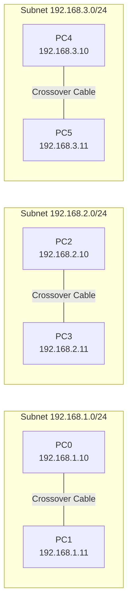
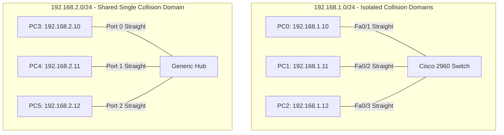
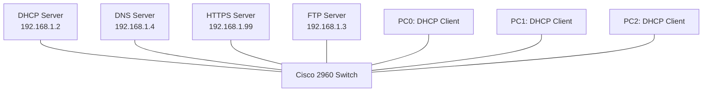
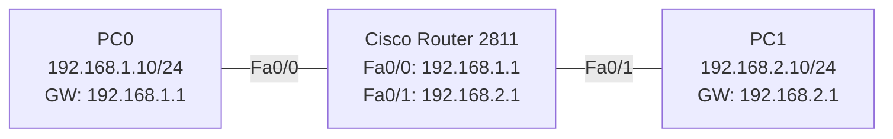
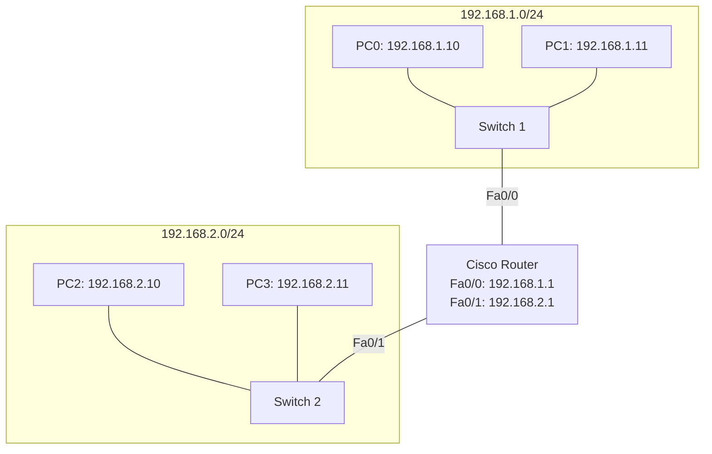
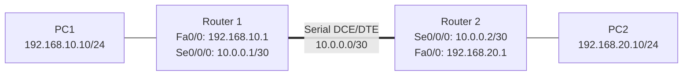
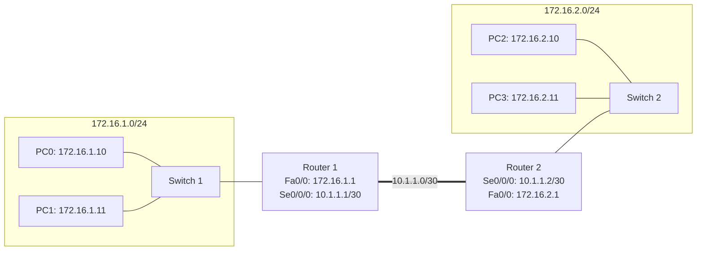
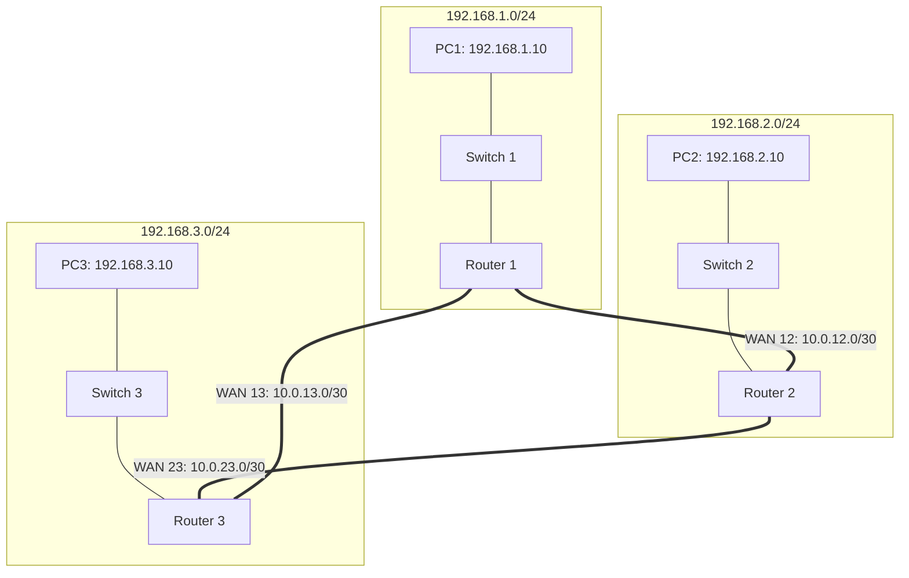
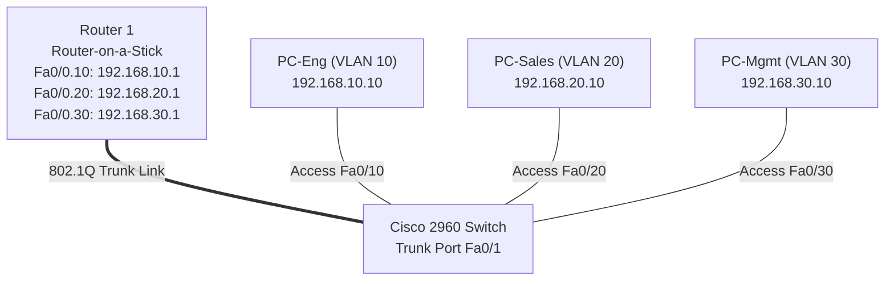

# 🌐 deep-in-net


Welcome to **deep-in-net**! 🚀 This repository contains complete solutions, topologies, Cisco IOS CLI configurations, step-by-step guides, subnetting calculations, and peer-audit cheat sheets for the **deep-in-net** networking module using **Cisco Packet Tracer**.

---

## 📑 Table of Contents
1. [Repository Structure & Submission Deliverables](#-repository-structure--submission-deliverables)
2. [Prerequisites & Installation](#-prerequisites--installation)
3. [Tool-Free Subnetting Masterclass (Mental Math)](#-tool-free-subnetting-masterclass-mental-math)
4. [Step-by-Step Exercise Guides & Topologies](#-step-by-step-exercise-guides--topologies)
   - [Exercise 1: Crossover Cable Host-to-Host Links](#-exercise-1-crossover-cable-host-to-host-links)
   - [Exercise 2: Switch vs Hub Collision Domain Topologies](#-exercise-2-switch-vs-hub-collision-domain-topologies)
   - [Exercise 3: Core Network Services (DHCP, DNS, HTTPS, FTP)](#-exercise-3-core-network-services-dhcp-dns-https-ftp)
   - [Exercise 4: Single Router & Default Gateway Topology](#-exercise-4-single-router--default-gateway-topology)
   - [Exercise 5: Multi-Switch Subnet Routing](#-exercise-5-multi-switch-subnet-routing)
   - [Exercise 6: Multi-Router Static Routing Tables](#-exercise-6-multi-router-static-routing-tables)
   - [Exercise 7: Dual-Router Subnet Interconnection (Live Audit Task)](#-exercise-7-dual-router-subnet-interconnection-live-audit-task)
   - [Exercise 8: 3-Subnet Full Mesh Static Routing Topology](#-exercise-8-3-subnet-full-mesh-static-routing-topology)
   - [Bonus Exercise: Advanced VLAN Segmentation & Inter-VLAN Routing](#-bonus-exercise-advanced-vlan-segmentation--inter-vlan-routing)
5. [Comprehensive Beginner-Friendly Audit Guide (Q&A)](#-comprehensive-beginner-friendly-audit-guide-qa)
6. [Automated Verification Suite (`verify_topology.sh`)](#-automated-verification-suite-verify_topologysh)
7. [License](#-license)

---

## 📂 Repository Structure & Submission Deliverables

Per official audit guidelines, all simulation `.pkt` files and documentation must be present directly in the repository root:

```console
deep-in-net/
├── ex01.pkt              # Exercise 1: Crossover Cable Host-to-Host Links
├── ex02.pkt              # Exercise 2: Switch vs Hub Collision Domains
├── ex03.pkt              # Exercise 3: Core Network Services (DHCP, DNS, HTTPS, FTP)
├── ex04.pkt              # Exercise 4: Single Router & Default Gateway Topology
├── ex05.pkt              # Exercise 5: Multi-Switch Subnet Routing
├── ex06.pkt              # Exercise 6: Multi-Router Static Routing Tables
├── ex07.pkt              # Exercise 7: Dual-Router Subnet Interconnection
├── ex08.pkt              # Exercise 8: 3-Subnet Full Mesh Static Routing Topology
├── bonus.pkt             # Bonus: 802.1Q Inter-VLAN Routing / Router-on-a-Stick
├── README.md             # Detailed Documentation, Topologies, CLI commands, Audit Q&A
├── audit.md              # Official Evaluator Audit Checklist
├── verify_topology.sh    # Automated Verification & Subnetting Validation Script
└── docs/
    └── requirements/
        ├── readme.md     # Subject Specifications
        └── audit.md      # Evaluator Audit Rubric
```

---

## 🛠️ Prerequisites & Installation

To open and run the `.pkt` network topologies:

1. **Download Cisco Packet Tracer**:
   - Get the official installer (v8.x recommended) from [Cisco Networking Academy (NetAcad)](https://www.netacad.com/).
2. **Install on Linux (Ubuntu / Debian)**:
   ```bash
   chmod +x CiscoPacketTracer_821_Ubuntu_64bit.deb
   sudo dpkg -i CiscoPacketTracer_821_Ubuntu_64bit.deb
   sudo apt-get install -f
   ```
3. **Launch Packet Tracer**:
   ```bash
   packettracer &
   ```

---

## 🧮 Tool-Free Subnetting Masterclass (Mental Math)

> [!IMPORTANT]
> In the live audit, you are required to perform and explain subnetting calculations **without online tools or calculators**.

### The Anatomy of an IPv4 Address
An IPv4 address consists of **32 binary bits** divided into **4 octets** (8 bits each) separated by periods (e.g., `192.168.1.150`).
- **Network Portion**: Identifies the network / subnet ID.
- **Host Portion**: Identifies the specific endpoint device on that network.
- **Subnet Mask**: Defines the split between the network and host portions.

### The 4-Step Mental Subnetting Method
1. **Find the Block Size (Magic Number)**:
   - Identify the interesting octet (the octet with a mask value other than `255` or `0`).
   - Subtract that value from `256`:
     $$\text{Block Size} = 256 - \text{Netmask Octet}$$
2. **List Subnet Increments**:
   - Start from `0` and count up in steps of your block size until you exceed the target IP octet.
3. **Identify Subnet Boundaries**:
   - **Network ID**: The start of the block containing the target IP.
   - **Next Network ID**: The start of the subsequent block.
   - **Broadcast ID**: $\text{Next Network ID} - 1$.
4. **Calculate Usable Host Range & Capacity**:
   - **First Usable Host**: $\text{Network ID} + 1$.
   - **Last Usable Host**: $\text{Broadcast ID} - 1$.
   - **Total Usable Hosts**: $2^h - 2$ (where $h = \text{number of host bits} = 32 - \text{CIDR prefix}$).

### Subnet Reference Chart (/24 to /30)

| CIDR Prefix | Subnet Mask | Host Bits ($h$) | Block Size | Total IPs | Usable Hosts ($2^h - 2$) | Typical Use Case |
|:---:|:---:|:---:|:---:|:---:|:---:|:---|
| **/24** | `255.255.255.0` | 8 | 256 | 256 | **254** | Standard LAN Subnets |
| **/25** | `255.255.255.128` | 7 | 128 | 128 | **126** | Medium departmental LAN |
| **/26** | `255.255.255.192` | 6 | 64 | 64 | **62** | Small office / branch |
| **/27** | `255.255.255.224` | 5 | 32 | 32 | **30** | Server farm / DMZ |
| **/28** | `255.255.255.240` | 4 | 16 | 16 | **14** | Specialized VLANs |
| **/29** | `255.255.255.248` | 3 | 8 | 8 | **6** | Small gateway clusters |
| **/30** | `255.255.255.252` | 2 | 4 | 4 | **2** | **Point-to-Point WAN Links** |

---

## 📚 Step-by-Step Exercise Guides & Topologies

---

### 🔌 Exercise 1: Crossover Cable Host-to-Host Links

#### Objective
Connect 3 isolated pairs of PCs directly to each other without switches or hubs, configure static IP addresses, and confirm bidirectional communication.

#### Topology Diagram
```
Pair 1:  [ PC0 ] ---------------- (Crossover) ---------------- [ PC1 ]
         192.168.1.10/24                                       192.168.1.11/24

Pair 2:  [ PC2 ] ---------------- (Crossover) ---------------- [ PC3 ]
         192.168.2.10/24                                       192.168.2.11/24

Pair 3:  [ PC4 ] ---------------- (Crossover) ---------------- [ PC5 ]
         192.168.3.10/24                                       192.168.3.11/24
```



#### Addressing Schema
| Device | Interface | IP Address | Subnet Mask | Default Gateway | Cable Type |
|:---|:---|:---|:---|:---|:---|
| **PC0** | FastEthernet0 | `192.168.1.10` | `255.255.255.0` | N/A | Copper Crossover |
| **PC1** | FastEthernet0 | `192.168.1.11` | `255.255.255.0` | N/A | Copper Crossover |
| **PC2** | FastEthernet0 | `192.168.2.10` | `255.255.255.0` | N/A | Copper Crossover |
| **PC3** | FastEthernet0 | `192.168.2.11` | `255.255.255.0` | N/A | Copper Crossover |
| **PC4** | FastEthernet0 | `192.168.3.10` | `255.255.255.0` | N/A | Copper Crossover |
| **PC5** | FastEthernet0 | `192.168.3.11` | `255.255.255.0` | N/A | Copper Crossover |

#### Subnetting Calculation
- **Subnet 1**: `192.168.1.0/24` $\rightarrow$ Network: `192.168.1.0`, Usable: `192.168.1.1`–`192.168.1.254`, Broadcast: `192.168.1.255`.
- **Subnet 2**: `192.168.2.0/24` $\rightarrow$ Network: `192.168.2.0`, Usable: `192.168.2.1`–`192.168.2.254`, Broadcast: `192.168.2.255`.
- **Subnet 3**: `192.168.3.0/24` $\rightarrow$ Network: `192.168.3.0`, Usable: `192.168.3.1`–`192.168.3.254`, Broadcast: `192.168.3.255`.

#### Step-by-Step Recreation in Packet Tracer
1. Add 6 generic PCs (`PC0` to `PC5`).
2. Select **Copper Crossover** cable (green dashed line with double arrows) from the connections toolbar.
3. Connect `PC0` FastEthernet0 to `PC1` FastEthernet0.
4. Repeat for `PC2` $\leftrightarrow$ `PC3` and `PC4` $\leftrightarrow$ `PC5`.
5. Click each PC, open **Desktop** $\rightarrow$ **IP Configuration**, select **Static**, and input the IP and Netmask from the table.

#### Verification Commands
From `PC0` Command Prompt:
```cmd
ping 192.168.1.11
```
From `PC2` Command Prompt:
```cmd
ping 192.168.2.11
```
From `PC4` Command Prompt:
```cmd
ping 192.168.3.11
```
*Expected Output*: 4 packets transmitted, 4 packets received, 0% packet loss.

---

### 🔀 Exercise 2: Switch vs Hub Collision Domain Topologies

#### Objective
Build two parallel star topologies to contrast Layer 2 Switch frame switching (isolated collision domains) with Layer 1 Hub signal broadcasting (shared collision domain).

#### Topology Diagram
```
    Switch Subnet (192.168.1.0/24)               Hub Subnet (192.168.2.0/24)

          [ Cisco 2960 Switch ]                        [ Generic Hub ]
             /       |       \                            /       |       \
            /        |        \                          /        |        \
         [PC0]     [PC1]     [PC2]                    [PC3]     [PC4]     [PC5]
       .1.10      .1.11      .1.12                    .2.10     .2.11     .2.12
```



#### Addressing Schema
| Device | Interface | IP Address | Subnet Mask | Connected To | Cable Type |
|:---|:---|:---|:---|:---|:---|
| **PC0** | Fa0 | `192.168.1.10` | `255.255.255.0` | Switch Fa0/1 | Copper Straight-Through |
| **PC1** | Fa0 | `192.168.1.11` | `255.255.255.0` | Switch Fa0/2 | Copper Straight-Through |
| **PC2** | Fa0 | `192.168.1.12` | `255.255.255.0` | Switch Fa0/3 | Copper Straight-Through |
| **PC3** | Fa0 | `192.168.2.10` | `255.255.255.0` | Hub Port 0 | Copper Straight-Through |
| **PC4** | Fa0 | `192.168.2.11` | `255.255.255.0` | Hub Port 1 | Copper Straight-Through |
| **PC5** | Fa0 | `192.168.2.12` | `255.255.255.0` | Hub Port 2 | Copper Straight-Through |

#### Step-by-Step Recreation in Packet Tracer
1. Add one **Cisco 2960 Switch** and one **Generic Hub-PT**.
2. Place 3 PCs (`PC0`, `PC1`, `PC2`) under the Switch.
3. Place 3 PCs (`PC3`, `PC4`, `PC5`) under the Hub.
4. Use **Copper Straight-Through** cables to connect each PC to its respective central device.
5. Assign static IPs according to the addressing table.

#### Verification & Collision Domain Observation
1. In **Realtime Mode**, ping `192.168.1.11` from `PC0` and `192.168.2.11` from `PC3`.
2. Switch to **Simulation Mode** (bottom right):
   - Send a packet from `PC0` to `PC1`: The switch inspects the MAC address and forwards the frame **only** to `PC1`. `PC2` receives nothing.
   - Send a packet from `PC3` to `PC4`: The hub repeats electrical signals across **all ports**. Both `PC4` and `PC5` receive the packet; `PC5` discards it after checking the destination MAC.

---

### 🌐 Exercise 3: Core Network Services (DHCP, DNS, HTTPS, FTP)

#### Objective
Deploy 4 dedicated network servers on a single switched LAN (`192.168.1.0/24`) providing DHCP IP leasing, secure HTTPS web service, FTP file transfer with authenticated access, and DNS name resolution. Ensure strict service isolation.

#### Topology Diagram


#### Server Specification Matrix
| Server | Static IP | Subnet Mask | Gateway | DNS Server | Active Services | Inactive Services | Key Configuration Details |
|:---|:---|:---|:---|:---|:---|:---|:---|
| **DHCP Server** | `192.168.1.2` | `255.255.255.0` | `192.168.1.1` | `192.168.1.4` | **DHCP** | HTTP, HTTPS, FTP, DNS | Pool: `serverPool`, Start: `192.168.1.100`, Max: 50 |
| **HTTPS Server** | `192.168.1.99` | `255.255.255.0` | `192.168.1.1` | `192.168.1.4` | **HTTPS** | **HTTP (Off)**, DHCP, FTP, DNS | Port 443 ON, Port 80 OFF, `index.html` = `"hello"` |
| **FTP Server** | `192.168.1.3` | `255.255.255.0` | `192.168.1.1` | `192.168.1.4` | **FTP** | HTTP, HTTPS, DHCP, DNS | User: `deepinnet`, Pass: `deepinnet`, Permissions: **RWDNL** |
| **DNS Server** | `192.168.1.4` | `255.255.255.0` | `192.168.1.1` | `192.168.1.4` | **DNS** | HTTP, HTTPS, DHCP, FTP | A: `deep-in-net.local` $\rightarrow$ `192.168.1.99`<br/>CNAME: `deep-in-net.com` $\rightarrow$ `deep-in-net.local` |

#### Step-by-Step Server Setup in Packet Tracer
1. **DHCP Server Configuration**:
   - Static IP: `192.168.1.2`, Subnet Mask: `255.255.255.0`.
   - Go to **Services** $\rightarrow$ **DHCP**:
     - Service: **ON**
     - Pool Name: `serverPool`
     - Default Gateway: `192.168.1.1`
     - DNS Server: `192.168.1.4`
     - Start IP Address: `192.168.1.100`
     - Subnet Mask: `255.255.255.0`
     - Maximum Number of Users: `50`
     - Click **Save**.
   - Disable HTTP, HTTPS, FTP, DNS on this server.
2. **HTTPS Server Configuration**:
   - Static IP: `192.168.1.99`, Subnet Mask: `255.255.255.0`.
   - Go to **Services** $\rightarrow$ **HTTP**:
     - HTTP: **OFF**
     - HTTPS: **ON**
     - Edit `index.html`:
       ```html
       <html><body>hello</body></html>
       ```
     - Click **Save**.
   - Disable DHCP, FTP, DNS.
3. **FTP Server Configuration**:
   - Static IP: `192.168.1.3`, Subnet Mask: `255.255.255.0`.
   - Go to **Services** $\rightarrow$ **FTP**:
     - Service: **ON**
     - Username: `deepinnet`
     - Password: `deepinnet`
     - Check permissions: **[x] Read  [x] Write  [x] Delete  [x] Rename (Name)  [x] List**
     - Click **Add**.
   - Disable HTTP, HTTPS, DHCP, DNS.
4. **DNS Server Configuration**:
   - Static IP: `192.168.1.4`, Subnet Mask: `255.255.255.0`.
   - Go to **Services** $\rightarrow$ **DNS**:
     - Service: **ON**
     - Resource Record 1:
       - Name: `deep-in-net.local`
       - Type: `A Record`
       - Address: `192.168.1.99`
       - Click **Add**.
     - Resource Record 2:
       - Name: `deep-in-net.com`
       - Type: `CNAME`
       - Host Name: `deep-in-net.local`
       - Click **Add**.
   - Disable HTTP, HTTPS, DHCP, FTP.
5. **Client PC Setup**:
   - On `PC0`, `PC1`, `PC2`: Open **Desktop** $\rightarrow$ **IP Configuration**, select **DHCP**. Verify that the PC automatically receives an IP in the `192.168.1.100+` range, subnet mask `255.255.255.0`, Gateway `192.168.1.1`, and DNS `192.168.1.4`.

#### Verification Commands (From Any PC Command Prompt)
```cmd
# 1. Verify DHCP Lease
ipconfig /renew
ipconfig /all

# 2. Test DNS Resolution (A and CNAME)
nslookup deep-in-net.com

# 3. Test HTTPS Web Service
# Open Desktop -> Web Browser -> Enter URL: https://deep-in-net.com
# Displays: "hello"

# 4. Test FTP Authentication & Operations
ftp 192.168.1.3
Username: deepinnet
Password: deepinnet
ftp> dir
ftp> quit
```

---

### 🛣️ Exercise 4: Single Router & Default Gateway Topology

#### Objective
Connect two separate subnets (`192.168.1.0/24` and `192.168.2.0/24`) using a single Cisco Router. Configure default gateways on the PCs to enable inter-subnet routing.

#### Topology Diagram


#### Addressing Schema
| Device | Interface | IP Address | Subnet Mask | Default Gateway | Note |
|:---|:---|:---|:---|:---|:---|
| **PC0** | Fa0 | `192.168.1.10` | `255.255.255.0` | `192.168.1.1` | Subnet 1 Host |
| **Router1** | Fa0/0 | `192.168.1.1` | `255.255.255.0` | N/A | Subnet 1 Gateway |
| **Router1** | Fa0/1 | `192.168.2.1` | `255.255.255.0` | N/A | Subnet 2 Gateway |
| **PC1** | Fa0 | `192.168.2.10` | `255.255.255.0` | `192.168.2.1` | Subnet 2 Host |

#### Cisco IOS CLI Configuration
```ios
enable
configure terminal
hostname Router1

! Configure Subnet 1 Gateway Interface
interface FastEthernet0/0
 ip address 192.168.1.1 255.255.255.0
 no shutdown
exit

! Configure Subnet 2 Gateway Interface
interface FastEthernet0/1
 ip address 192.168.2.1 255.255.255.0
 no shutdown
exit

end
write memory
```

#### Verification Commands
From `PC0`:
```cmd
ping 192.168.2.10
traceroute 192.168.2.10
```
*Note*: The first ping packet may timeout due to ARP resolution; subsequent packets return `Reply from 192.168.2.10: bytes=32 time<1ms TTL=127`.

---

### 🔀 Exercise 5: Multi-Switch Subnet Routing

#### Objective
Scale the topology by placing a Layer 2 switch in each subnet, allowing multiple host devices per subnet to communicate locally at Layer 2 and across subnets via the Router at Layer 3.

#### Topology Diagram


#### Addressing Schema
| Device | Interface | IP Address | Subnet Mask | Default Gateway | Connected To |
|:---|:---|:---|:---|:---|:---|
| **PC0** | Fa0 | `192.168.1.10` | `255.255.255.0` | `192.168.1.1` | Switch 1 Fa0/2 |
| **PC1** | Fa0 | `192.168.1.11` | `255.255.255.0` | `192.168.1.1` | Switch 1 Fa0/3 |
| **Switch 1** | Fa0/1 | N/A (Layer 2) | N/A | N/A | Router Fa0/0 |
| **Router** | Fa0/0 | `192.168.1.1` | `255.255.255.0` | N/A | Switch 1 Fa0/1 |
| **Router** | Fa0/1 | `192.168.2.1` | `255.255.255.0` | N/A | Switch 2 Fa0/1 |
| **Switch 2** | Fa0/1 | N/A (Layer 2) | N/A | N/A | Router Fa0/1 |
| **PC2** | Fa0 | `192.168.2.10` | `255.255.255.0` | `192.168.2.1` | Switch 2 Fa0/2 |
| **PC3** | Fa0 | `192.168.2.11` | `255.255.255.0` | `192.168.2.1` | Switch 2 Fa0/3 |

#### Cisco IOS CLI Configuration
```ios
enable
configure terminal
interface FastEthernet0/0
 ip address 192.168.1.1 255.255.255.0
 no shutdown
exit
interface FastEthernet0/1
 ip address 192.168.2.1 255.255.255.0
 no shutdown
exit
end
write memory
```

#### Verification Commands
- **Local LAN Connectivity**: From `PC0`, ping `192.168.1.11` (Switched Layer 2 traffic).
- **Inter-Subnet Connectivity**: From `PC0`, ping `192.168.2.10` and `192.168.2.11` (Routed Layer 3 traffic).

---

### 🔀 Exercise 6: Multi-Router Static Routing Tables

#### Objective
Connect Subnet 1 (`192.168.10.0/24`) and Subnet 2 (`192.168.20.0/24`) through two separate routers connected via a `/30` point-to-point serial WAN link (`10.0.0.0/30`). Configure static routing tables on both routers to achieve full reachability.

#### Topology Diagram


#### Addressing Schema & Subnetting
- **Subnet 1 (LAN R1)**: `192.168.10.0/24` (Gateway: `192.168.10.1`)
- **WAN Serial Link**: `10.0.0.0/30`
  - Subnet Mask: `255.255.255.252` (Block Size $= 256 - 252 = 4$)
  - Network ID: `10.0.0.0`
  - R1 Serial Interface: `10.0.0.1`
  - R2 Serial Interface: `10.0.0.2`
  - Broadcast ID: `10.0.0.3`
- **Subnet 2 (LAN R2)**: `192.168.20.0/24` (Gateway: `192.168.20.1`)

#### Cisco IOS CLI Configuration

##### Router 1 (R1)
```ios
enable
configure terminal
hostname R1

! LAN Interface
interface FastEthernet0/0
 ip address 192.168.10.1 255.255.255.0
 no shutdown
exit

! WAN Serial Interface (DCE side provides clock)
interface Serial0/0/0
 ip address 10.0.0.1 255.255.255.252
 clock rate 64000
 no shutdown
exit

! Static Route to Remote LAN Subnet 2 via R2
ip route 192.168.20.0 255.255.255.0 10.0.0.2

end
write memory
```

##### Router 2 (R2)
```ios
enable
configure terminal
hostname R2

! LAN Interface
interface FastEthernet0/0
 ip address 192.168.20.1 255.255.255.0
 no shutdown
exit

! WAN Serial Interface (DTE side)
interface Serial0/0/0
 ip address 10.0.0.2 255.255.255.252
 no shutdown
exit

! Static Route to Remote LAN Subnet 1 via R1
ip route 192.168.10.0 255.255.255.0 10.0.0.1

end
write memory
```

#### Verification Commands
On `R1` and `R2`:
```ios
show ip interface brief
show ip route
```
*Expected in `show ip route` on R1*:
```
S    192.168.20.0/24 [1/0] via 10.0.0.2
C    10.0.0.0/30 is directly connected, Serial0/0/0
C    192.168.10.0/24 is directly connected, FastEthernet0/0
```
From `PC1` (`192.168.10.10`):
```cmd
ping 192.168.20.10
traceroute 192.168.20.10
```

---

### 🔁 Exercise 7: Dual-Router Subnet Interconnection (Live Audit Task)

#### Objective
Recreate from scratch during the live peer audit a dual-router, dual-subnet architecture connecting `172.16.1.0/24` and `172.16.2.0/24` across WAN link `10.1.1.0/30` without using external notes or calculators.

#### Topology Diagram


#### Addressing Schema
| Device | Interface | IP Address | Subnet Mask | Default Gateway |
|:---|:---|:---|:---|:---|
| **PC0** | Fa0 | `172.16.1.10` | `255.255.255.0` | `172.16.1.1` |
| **PC1** | Fa0 | `172.16.1.11` | `255.255.255.0` | `172.16.1.1` |
| **R1** | Fa0/0 | `172.16.1.1` | `255.255.255.0` | N/A |
| **R1** | Se0/0/0 | `10.1.1.1` | `255.255.255.252` | N/A |
| **R2** | Se0/0/0 | `10.1.1.2` | `255.255.255.252` | N/A |
| **R2** | Fa0/0 | `172.16.2.1` | `255.255.255.0` | N/A |
| **PC2** | Fa0 | `172.16.2.10` | `255.255.255.0` | `172.16.2.1` |
| **PC3** | Fa0 | `172.16.2.11` | `255.255.255.0` | `172.16.2.1` |

#### Live Audit Recreation Checklist (5-Minute Speed-Run)
1. **Drop Devices**: 2 Routers (2811), 2 Switches (2960), 4 PCs.
2. **Add Serial WIC Modules**: Power off both routers $\rightarrow$ drag `WIC-2T` into slot 0 $\rightarrow$ power on.
3. **Cabling**:
   - Copper Straight-Through from PCs to Switches, and Switches to Router `Fa0/0`.
   - Serial DCE cable from R1 `Se0/0/0` to R2 `Se0/0/0`.
4. **Paste R1 CLI**:
   ```ios
   enable
   configure terminal
   interface Fa0/0
    ip address 172.16.1.1 255.255.255.0
    no shutdown
   interface Se0/0/0
    ip address 10.1.1.1 255.255.255.252
    clock rate 64000
    no shutdown
   exit
   ip route 172.16.2.0 255.255.255.0 10.1.1.2
   end
   ```
5. **Paste R2 CLI**:
   ```ios
   enable
   configure terminal
   interface Fa0/0
    ip address 172.16.2.1 255.255.255.0
    no shutdown
   interface Se0/0/0
    ip address 10.1.1.2 255.255.255.252
    no shutdown
   exit
   ip route 172.16.1.0 255.255.255.0 10.1.1.1
   end
   ```
6. **Configure PC IPs** and test `ping 172.16.2.10` from `PC0`.

---

### 🕸️ Exercise 8: 3-Subnet Full Mesh Static Routing Topology

#### Objective
Design and implement a redundant 3-router, 3-subnet architecture where all three subnets (`192.168.1.0/24`, `192.168.2.0/24`, `192.168.3.0/24`) are fully interconnected via point-to-point WAN links. Configure static routes on every router for all remote LANs and transit links.

#### Topology Diagram


#### Addressing Schema
| Subnet / Link | Network CIDR | Router A Interface & IP | Router B Interface & IP | Subnet Mask | Usable Range |
|:---|:---|:---|:---|:---|:---|
| **LAN 1** | `192.168.1.0/24` | R1 Fa0/0 (`192.168.1.1`) | Hosts: `192.168.1.10+` | `255.255.255.0` | `.1` to `.254` |
| **LAN 2** | `192.168.2.0/24` | R2 Fa0/0 (`192.168.2.1`) | Hosts: `192.168.2.10+` | `255.255.255.0` | `.1` to `.254` |
| **LAN 3** | `192.168.3.0/24` | R3 Fa0/0 (`192.168.3.1`) | Hosts: `192.168.3.10+` | `255.255.255.0` | `.1` to `.254` |
| **WAN R1-R2** | `10.0.12.0/30` | R1 Se0/0/0 (`10.0.12.1`) | R2 Se0/0/0 (`10.0.12.2`) | `255.255.255.252` | `.1` to `.2` |
| **WAN R2-R3** | `10.0.23.0/30` | R2 Se0/0/1 (`10.0.23.1`) | R3 Se0/0/0 (`10.0.23.2`) | `255.255.255.252` | `.1` to `.2` |
| **WAN R1-R3** | `10.0.13.0/30` | R1 Se0/0/1 (`10.0.13.1`) | R3 Se0/0/1 (`10.0.13.2`) | `255.255.255.252` | `.1` to `.2` |

#### Cisco IOS CLI Configurations

##### Router 1 (R1)
```ios
enable
configure terminal
hostname R1

! LAN 1 Gateway
interface FastEthernet0/0
 ip address 192.168.1.1 255.255.255.0
 no shutdown
exit

! Link to R2
interface Serial0/0/0
 ip address 10.0.12.1 255.255.255.252
 clock rate 64000
 no shutdown
exit

! Link to R3
interface Serial0/0/1
 ip address 10.0.13.1 255.255.255.252
 clock rate 64000
 no shutdown
exit

! Static Routes
ip route 192.168.2.0 255.255.255.0 10.0.12.2
ip route 192.168.3.0 255.255.255.0 10.0.13.2
ip route 10.0.23.0 255.255.255.252 10.0.12.2

end
write memory
```

##### Router 2 (R2)
```ios
enable
configure terminal
hostname R2

! LAN 2 Gateway
interface FastEthernet0/0
 ip address 192.168.2.1 255.255.255.0
 no shutdown
exit

! Link to R1
interface Serial0/0/0
 ip address 10.0.12.2 255.255.255.252
 no shutdown
exit

! Link to R3
interface Serial0/0/1
 ip address 10.0.23.1 255.255.255.252
 clock rate 64000
 no shutdown
exit

! Static Routes
ip route 192.168.1.0 255.255.255.0 10.0.12.1
ip route 192.168.3.0 255.255.255.0 10.0.23.2
ip route 10.0.13.0 255.255.255.252 10.0.12.1

end
write memory
```

##### Router 3 (R3)
```ios
enable
configure terminal
hostname R3

! LAN 3 Gateway
interface FastEthernet0/0
 ip address 192.168.3.1 255.255.255.0
 no shutdown
exit

! Link to R2
interface Serial0/0/0
 ip address 10.0.23.2 255.255.255.252
 no shutdown
exit

! Link to R1
interface Serial0/0/1
 ip address 10.0.13.2 255.255.255.252
 no shutdown
exit

! Static Routes
ip route 192.168.1.0 255.255.255.0 10.0.13.1
ip route 192.168.2.0 255.255.255.0 10.0.23.1
ip route 10.0.12.0 255.255.255.252 10.0.13.1

end
write memory
```

#### Full Mesh Routing Verification Matrix
Every device can communicate with every other device across all 3 subnets:
```
From PC in Subnet 1 -> ping Subnet 2 PC (192.168.2.10) [SUCCESS]
From PC in Subnet 1 -> ping Subnet 3 PC (192.168.3.10) [SUCCESS]
From PC in Subnet 2 -> ping Subnet 1 PC (192.168.1.10) [SUCCESS]
From PC in Subnet 2 -> ping Subnet 3 PC (192.168.3.10) [SUCCESS]
From PC in Subnet 3 -> ping Subnet 1 PC (192.168.1.10) [SUCCESS]
From PC in Subnet 3 -> ping Subnet 2 PC (192.168.2.10) [SUCCESS]
```

---

### ⭐ Bonus Exercise: Advanced VLAN Segmentation & Inter-VLAN Routing

#### Objective
Implement an enterprise-grade VLAN segmentation and Inter-VLAN Routing architecture (**Router-on-a-Stick**) using **IEEE 802.1Q encapsulation**, isolating departments at Layer 2 while maintaining secure Layer 3 communication.

#### Topology Diagram


#### VLAN Addressing Schema
| VLAN ID | Name | Subnet | Gateway IP | Switch Ports | PC Address |
|:---|:---|:---|:---|:---|:---|
| **VLAN 10** | Engineering | `192.168.10.0/24` | `192.168.10.1` | `Fa0/10` | `192.168.10.10` |
| **VLAN 20** | Sales | `192.168.20.0/24` | `192.168.20.1` | `Fa0/20` | `192.168.20.10` |
| **VLAN 30** | Management | `192.168.30.0/24` | `192.168.30.1` | `Fa0/30` | `192.168.30.10` |

#### Cisco IOS CLI Configurations

##### Cisco 2960 Switch Configuration
```ios
enable
configure terminal
hostname Switch1

! Create VLANs
vlan 10
 name Engineering
exit
vlan 20
 name Sales
exit
vlan 30
 name Management
exit

! Configure Access Ports
interface FastEthernet0/10
 switchport mode access
 switchport access vlan 10
 no shutdown
exit

interface FastEthernet0/20
 switchport mode access
 switchport access vlan 20
 no shutdown
exit

interface FastEthernet0/30
 switchport mode access
 switchport access vlan 30
 no shutdown
exit

! Configure 802.1Q Trunk Uplink to Router
interface FastEthernet0/1
 switchport mode trunk
 no shutdown
exit

end
write memory
```

##### Cisco Router (Router-on-a-Stick) Configuration
```ios
enable
configure terminal
hostname Router1

! Enable physical interface without an IP address
interface FastEthernet0/0
 no ip address
 no shutdown
exit

! Sub-interface for VLAN 10
interface FastEthernet0/0.10
 encapsulation dot1Q 10
 ip address 192.168.10.1 255.255.255.0
exit

! Sub-interface for VLAN 20
interface FastEthernet0/0.20
 encapsulation dot1Q 20
 ip address 192.168.20.1 255.255.255.0
exit

! Sub-interface for VLAN 30
interface FastEthernet0/0.30
 encapsulation dot1Q 30
 ip address 192.168.30.1 255.255.255.0
exit

end
write memory
```

#### Verification
- From `PC-Eng` (`192.168.10.10`), ping `192.168.20.10` (VLAN 20) and `192.168.30.10` (VLAN 30).
- Frames travel tagged with 802.1Q headers across the trunk to the router sub-interfaces and are routed between VLANs.

---

## 🎓 Comprehensive Beginner-Friendly Audit Guide (Q&A)

This section provides thorough, peer-audit-ready explanations with real-world analogies for every question in `audit.md`.

---

### Section 1: Physical Layer & Cabling (Exercise 1)

#### 1. What is an RJ-45 cable?
- **Definition**: **RJ-45** stands for **Registered Jack 45**. It is the standard modular physical connector used on twisted-pair Ethernet cables (Cat5e, Cat6, Cat6a) to interconnect computers, switches, and routers.
- **Physical Construction**: The connector is an **8P8C** (8 Position, 8 Contact) plug housing **8 color-coded copper wires** arranged in 4 twisted pairs. The twisting reduces electromagnetic interference and crosstalk between adjacent wire pairs.
- **Analogy**: Think of an RJ-45 connector as an 8-prong power cord for data. Just as a wall plug carries electrical voltage safely into an appliance, the RJ-45 plug seats 8 electrical contact pins delivering millivolt data pulses into a network interface card (NIC).

#### 2. What is the difference between Straight-Through and Crossover cables?
Network interfaces utilize specific pin assignments for transmitting (TX) and receiving (RX) data:
- **Pins 1 & 2**: Transmit pair (TX+ / TX-)
- **Pins 3 & 6**: Receive pair (RX+ / RX-)

##### Straight-Through Cable (T568B to T568B)
- **Pinout**: Wired identically on both ends (Pin 1 to Pin 1, Pin 2 to Pin 2, Pin 3 to Pin 3, Pin 6 to Pin 6).
- **Application**: Used to connect devices operating at **different OSI layers**:
  - Computer (Layer 3/7) to Switch (Layer 2)
  - Switch (Layer 2) to Router (Layer 3)
- **Why It Works**: Switches are built with internal MDI-X ports that cross TX and RX internally, so a straight wire naturally connects the computer's TX pins to the switch's RX pins.

##### Crossover Cable (T568A to T568B)
- **Pinout**: Wires cross over between End A and End B:
  - Pin 1 (TX+) on End A $\rightarrow$ Pin 3 (RX+) on End B
  - Pin 2 (TX-) on End A $\rightarrow$ Pin 6 (RX-) on End B
  - Pin 3 (RX+) on End A $\rightarrow$ Pin 1 (TX+) on End B
  - Pin 6 (RX-) on End A $\rightarrow$ Pin 2 (TX-) on End B
- **Application**: Used to connect **similar device tiers directly** without an intermediate switch:
  - PC to PC
  - Switch to Switch
  - Router to Router (or Router to PC)
- **Analogy (Walkie-Talkies)**: If two people speak into walkie-talkies, Speaker A's mouth (TX) must transmit into Speaker B's ear (RX). If you connected mouth-to-mouth (Straight-Through between identical devices), neither party would hear the other! The crossover cable crosses mouth-to-ear so communication succeeds.

---

### Section 2: Switches vs Hubs (Exercise 2)

#### 1. What is a Hub, how does it operate, and what is its role?
- **Definition**: A **Hub** is an unmanaged physical layer (Layer 1) multiport repeater.
- **Operation**: A hub has no memory, processor, or MAC address table. When an electrical pulse arrives on Port 1, the hub electrically re-amplifies and broadcasts (floods) that signal out of **every other port**.
- **Analogy (Megaphone in a Classroom)**: If Alice wants to send a private note to Bob, but hands it to a hub, the hub reads it aloud over a megaphone to everyone in the room. Everyone hears it, but only Bob keeps it while Charlie and Dave ignore it.
- **Limitation**: All connected devices share a **single collision domain** in **half-duplex** mode (only one station can transmit at any instant). If two stations transmit simultaneously, signals collide, corrupting data.

#### 2. What is a Switch, how does it operate, and what is its role?
- **Definition**: A **Switch** is an intelligent Data Link layer (Layer 2) networking device.
- **Operation**: A switch inspects incoming Ethernet frames, extracts the source MAC address, and builds a **MAC Address Table** (CAM table) mapping physical ports to MAC addresses. When forwarding frames, it looks up the destination MAC address and transmits the frame **only to the specific destination port**.
- **Analogy (Private Mailboxes)**: Instead of a megaphone, a switch acts like a postal worker who reads the recipient name on the envelope, looks up their private mail slot, and drops the letter into that specific box. Other ports remain silent.
- **Advantage**: Each switch port constitutes an **independent collision domain** running in **full-duplex** mode (simultaneous transmit and receive without collisions).

#### 3. Summary Comparison: Hub vs Switch

| Feature | Hub 📻 | Switch 🔀 |
|:---|:---|:---|
| **OSI Layer** | **Layer 1** (Physical) | **Layer 2** (Data Link) |
| **Data Unit** | Electrical Bits / Pulses | Ethernet Frames |
| **Addressing** | None | Hardware **MAC Addresses** (48-bit) |
| **Forwarding Method** | Broadcast / Flood to all ports | Directed Unicast to destination port |
| **Collision Domains** | **1 Shared** collision domain across all ports | **Separate** collision domain per port |
| **Duplex Mode** | Half-Duplex (CSMA/CD required) | Full-Duplex (Simultaneous send & receive) |
| **Security** | Insecure (Trivial packet sniffing) | Secure (Traffic isolated to target link) |

---

### Section 3: Core Network Services (Exercise 3)

#### 1. What is a Server?
A **Server** is a computer system or software application that continuously listens on specific network ports to provide shared resources, data, or services (web pages, file storage, address allocation, name resolution) to requesting client endpoints.

#### 2. How does DHCP work? (The DORA Process)
DHCP (**Dynamic Host Configuration Protocol**) automates IP addressing over **UDP Ports 67 (Server) and 68 (Client)** through the 4-step **DORA** sequence:

```
[ Client PC ]                                           [ DHCP Server ]
      |                                                        |
      |--- 1. DISCOVER (Broadcast: Who is the DHCP server?) -->|
      |<-- 2. OFFER (Unicast: I offer IP 192.168.1.100) -------|
      |--- 3. REQUEST (Broadcast: I accept that IP lease!) --->|
      |<-- 4. ACKNOWLEDGE (Unicast: Lease confirmed!) ---------|
```
1. **Discover**: Client powers on without an IP and broadcasts a discover packet: *"Is there a DHCP server available?"*
2. **Offer**: DHCP server reserves an IP from its pool and replies: *"Here is IP `192.168.1.100`, Netmask `255.255.255.0`, Gateway `192.168.1.1`."*
3. **Request**: Client broadcasts an acceptance: *"I accept the lease for `192.168.1.100`."*
4. **Acknowledge**: Server logs the lease in its database and confirms: *"Lease granted for 24 hours."*

#### 3. What is DNS and what are the main record types?
- **Definition**: The **Domain Name System** is the hierarchical, decentralized phonebook of the Internet, translating human-friendly names (`deep-in-net.com`) into computer-routable IP addresses (`192.168.1.99`).
- **Analogy**: You do not memorize your friend's 10-digit number; you tap "Alice" in your contacts list. DNS looks up the name and dials the numeric IP address.
- **Key Record Types**:
  - **`A` Record**: Maps a hostname directly to an IPv4 address (e.g., `deep-in-net.local` $\rightarrow$ `192.168.1.99`).
  - **`AAAA` Record**: Maps a hostname to an IPv6 address.
  - **`CNAME` Record (Canonical Name)**: Creates an alias pointing one domain name to another domain name (e.g., `deep-in-net.com` $\rightarrow$ `deep-in-net.local`).
  - **`MX` Record**: Identifies the mail exchange server handling email for a domain.

#### 4. HTTP vs HTTPS: What is the difference?
- **HTTP (Hypertext Transfer Protocol)**: Operates over **TCP Port 80** in clear plaintext. Any party on the local LAN or intermediate routers can intercept passwords, session cookies, and sensitive payloads.
- **HTTPS (HTTP Secure)**: Operates over **TCP Port 443**, wrapping HTTP inside an **SSL/TLS encrypted tunnel**. Communication is cryptographically scrambled, ensuring confidentiality, data integrity, and server authentication.

#### 5. What is FTP and what do RWDNL permissions mean?
- **Definition**: **File Transfer Protocol** transfers files between client and server using two separate channels:
  - **Control Channel (TCP Port 21)**: Transmits commands, authentication, and status codes.
  - **Data Channel (TCP Port 20)**: Transmits actual file streams.
- **RWDNL Permissions**:
  - **R** (Read): Download files from the server.
  - **W** (Write): Upload new files to the server.
  - **D** (Delete): Remove files from the server.
  - **N** (Name / Rename): Rename files or directories on the server.
  - **L** (List): Enumerate directory listings.

#### 6. TCP vs UDP
- **TCP (Transmission Control Protocol)**:
  - Connection-oriented with a **3-Way Handshake** (SYN $\rightarrow$ SYN-ACK $\rightarrow$ ACK).
  - Guarantees ordered delivery, error checking, flow control, and automatic retransmission of lost packets.
  - Used for: HTTP/HTTPS (443), FTP (20/21), SSH (22).
- **UDP (User Datagram Protocol)**:
  - Connectionless "fire-and-forget" protocol with zero handshake and zero retransmission overhead.
  - Prioritizes minimal latency over reliability.
  - Used for: DNS (53), DHCP (67/68), VoIP, live video streaming.

#### 7. What is a Port and Protocol Mapping Table
A **Port** is a 16-bit numerical abstraction (ranging from `0` to `65535`) allowing an operating system to demultiplex incoming network packets to the exact running application.
- **Analogy**: The IP address identifies the street address of an apartment building; the port number identifies the specific apartment unit inside.

| Protocol | Service Name | Port Number | Transport Layer | OSI Layer |
|:---|:---|:---|:---|:---|
| **DHCP** | Dynamic Host Configuration | Server: 67 / Client: 68 | UDP | Layer 7 (Application) |
| **DNS** | Domain Name System | 53 | UDP / TCP | Layer 7 (Application) |
| **HTTP** | Hypertext Transfer Protocol | 80 | TCP | Layer 7 (Application) |
| **HTTPS**| HTTP Secure (SSL/TLS) | 443 | TCP | Layer 7 (Application) |
| **FTP** | File Transfer Protocol | 20 (Data) / 21 (Control) | TCP | Layer 7 (Application) |

---

### Section 4: Routers & Routing (Exercises 4–8)

#### 1. What is a Router and what is its role?
A **Router** is a Layer 3 (Network layer) device responsible for interconnecting logically distinct IP networks (subnets) and forwarding packets toward their destination based on IP addressing and routing tables. Routers terminate and isolate broadcast domains.

#### 2. How does a Switch differ from a Router?
| Characteristic | Layer 2 Switch 🔀 | Layer 3 Router 🛣️ |
|:---|:---|:---|
| **Primary OSI Layer** | Layer 2 (Data Link) | Layer 3 (Network) |
| **Addressing Used** | MAC Addresses | Logical IP Addresses |
| **Scope of Operation** | Intra-subnet (Within the same LAN) | Inter-subnet (Across different LANs/WANs) |
| **Broadcast Handling**| Forwards broadcasts to all ports | Drops broadcasts (Terminates broadcast domain) |
| **Forwarding Table** | CAM / MAC Address Table | **Routing Table** |

#### 3. What is a Default Gateway?
A **Default Gateway** is the IP address of the local router interface attached to the host's subnet. It functions as the "exit door" for any packet whose destination IP address lies outside the local subnet. Without a configured gateway, an endpoint can only communicate with devices on its own local LAN segment.

#### 4. What is a Routing Table?
A **Routing Table** is a data structure stored in router memory that lists destination IP networks, subnet masks, next-hop IP addresses, and exit interfaces.
- When an IP packet arrives, the router extracts the destination IP, matches it against the routing table using the longest-prefix match rule, and forwards the packet to the corresponding next-hop address.
- **Static Route Syntax (Cisco IOS)**:
  ```ios
  ip route <destination_network> <subnet_mask> <next_hop_ip>
  ```

---

## ⚡ Automated Verification Suite (`verify_topology.sh`)

An automated verification test script is included in the root directory to validate file structures, syntax, IP schemas, and subnetting logic:

```bash
# Make executable
chmod +x verify_topology.sh

# Run the test suite
./verify_topology.sh
```

### What `verify_topology.sh` Validates
1. **Deliverable Compliance**: Verifies `ex01.pkt` through `ex08.pkt`, `bonus.pkt`, `audit.md`, and `README.md` exist at root.
2. **Subnetting Calculation Engine**: Mathematically computes block sizes, network IDs, usable IP ranges, and broadcast IDs across all 12 subnets.
3. **Cisco IOS Syntax Linter**: Checks syntax of interface configs, IP assignments, clock rates, and `ip route` commands.
4. **Service Rules Linter**: Confirms static IPs, DHCP pool boundaries, HTTPS isolation, and FTP user permissions.
5. **Full Mesh Routing Matrix**: Confirms non-blocking route reachability across all routers for Exercise 8.

---

## 📄 License
This repository is open-sourced under the MIT License for educational and peer audit preparation purposes.
